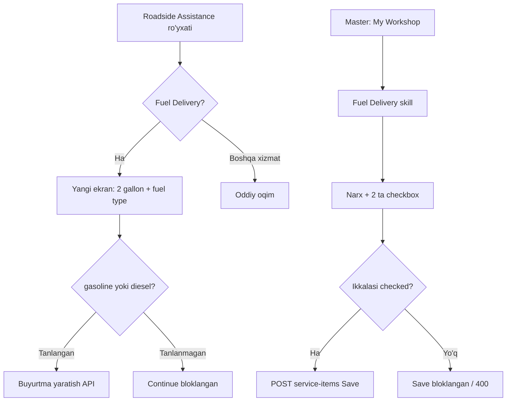

# Fuel Delivery — Frontend (Mobile) qo‘llanma

Bu hujjat **client (haydovchi)** va **master (usta)** ilovalari uchun Fuel Delivery ekranlari, API chaqiruvlari va validatsiya qoidalarini tavsiflaydi.

Backend tafsilotlari: `docs/FUEL_DELIVERY_BACKEND.md`

---

## 1. Umumiy oqim



---

## 2. Client (haydovchi) — UI

### 2.1 Ekran 1: Roadside Assistance

Mavjud ro‘yxat. **Fuel Delivery** bosilganda **yangi ekranga** o‘tish (to‘g‘ridan-to‘g‘ri buyurtma yaratmaslik).

### 2.2 Ekran 2: Fuel Delivery (yangi — majburiy)

**Sarlavha:** `Fuel Delivery`

**Asosiy matn:**
```
Delivery of 2 gallons of fuel
```

**Subtekst:**
```
Select the type of fuel you need.
```

**Bo‘lim:** `Fuel type`

| Variant | API qiymati | UI label (tavsiya) | Subtekst |
|---------|-------------|-------------------|----------|
| Benzin | `gasoline` | Gas (Regular) | For most gasoline vehicles |
| Dizel | `diesel` | Diesel | For diesel engines |

- Radio / card tanlov — **bittasi majburiy**
- **Continue** faqat tanlovdan keyin aktiv
- Default tanlov ixtiyoriy (masalan, `gasoline` pre-select)

### 2.3 Buyurtma yaratish

Continue bosilgach — standard yoki SOS oqimiga qarab API chaqiriladi.

**Qaysi `category_id`?** Katalogdan kelgan Fuel Delivery kategoriyasi ID si (`category_list` ga qo‘shiladi).

---

## 3. Client — API

### 3.1 Standard buyurtma

```http
POST /api/order/standard/
Authorization: Bearer <token>
Content-Type: application/json
```

```json
{
  "master_id": 5,
  "text": "Need fuel",
  "location": "Highway mile 42",
  "latitude": 41.311100,
  "longitude": 69.279700,
  "car_list": [1],
  "category_list": [<FUEL_DELIVERY_CATEGORY_ID>],
  "fuel_type": "gasoline"
}
```

| Field | Majburiy | Izoh |
|-------|----------|------|
| `fuel_type` | **Ha** (Fuel Delivery bo‘lsa) | `"gasoline"` yoki `"diesel"` |
| `category_list` | Ha | Fuel Delivery category ID |
| `master_id` | Standard uchun ha | Master Fuel Delivery ni faollashtirgan bo‘lishi kerak |

**Javob (201):**

```json
{
  "message": "Your order has been created and sent to the master",
  "order": {
    "id": 123,
    "fuel_delivery_type": "gasoline",
    "fuel_delivery_type_display": "Gasoline",
    "fuel_delivery_summary": "Delivery of 2 gallons of fuel (Gasoline)",
    "services": [ ... ],
    "category_data": [ ... ]
  }
}
```

> **Eslatma:** `id` `order` ichida — `response.order.id`, to‘g‘ridan-to‘g‘ri `response.id` emas.

### 3.2 SOS buyurtma

```http
POST /api/order/sos/
```

Xuddi shu body; `fuel_type` Fuel Delivery uchun majburiy. `master_id` ixtiyoriy (navbat avtomatik).

### 3.3 Multipart

Agar `multipart/form-data` ishlatilsa:
- `fuel_type` — oddiy string field: `gasoline` yoki `diesel`
- `category_list` — JSON string: `"[42]"`

---

## 4. Client — xatoliklar

| Status | Field | UI xabari (tavsiya) |
|--------|-------|---------------------|
| 400 | `fuel_type` | Please select fuel type (Gasoline or Diesel). |
| 400 | `master_id` | This master is not available for Fuel Delivery. |
| 400 | `category_list` (SOS) | No masters with Fuel Delivery are available nearby. |

---

## 5. Master (usta) — UI

### 5.1 Roadside Assistance → Fuel Delivery (skill sozlash)

Fuel Delivery qatorini ochganda (expand):

1. **Price ($)** — mavjud narx maydoni
2. **Equipment Availability** bo‘limi:
   - Matn: *Please confirm which fuel containers you have available.*
   - Checkbox 1: **I have a separate 2-gallon gas container**
   - Checkbox 2: **I have a separate 2-gallon diesel container**

### 5.2 Save qoidalari

| Holat | Save |
|-------|------|
| Ikkala checkbox belgilangan + narx ≥ 0 | ✅ Ruxsat |
| Kamida bittasi belgilanmagan | ❌ Bloklash + xabar |
| API 400 qaytarsa | Xato ko‘rsatish |

**Xabar (tavsiya):**
```
Both fuel containers must be confirmed to activate Fuel Delivery.
```

---

## 6. Master — API

### 6.1 Skill qo‘shish / yangilash

```http
POST /api/master/service-items/
Authorization: Bearer <master_token>
Content-Type: application/json
```

```json
{
  "services": [
    {
      "category": <FUEL_DELIVERY_CATEGORY_ID>,
      "price": 100,
      "has_gas_container_2gal": true,
      "has_diesel_container_2gal": true
    }
  ]
}
```

Yoki mavjud qatorni yangilash:

```http
PUT /api/master/service-items/<item_id>/
```

```json
{
  "price": 100,
  "has_gas_container_2gal": true,
  "has_diesel_container_2gal": true
}
```

### 6.2 API maydonlari ↔ UI

| API field | UI checkbox |
|-----------|-------------|
| `has_gas_container_2gal` | I have a separate 2-gallon gas container |
| `has_diesel_container_2gal` | I have a separate 2-gallon diesel container |
| `fuel_delivery_active` | Skill faolmi (ikkala `true` bo‘lsa `true`) |

### 6.3 Master ro‘yxatini o‘qish

`GET` master profile / services javobida har bir skill qatorida:

```json
{
  "category_id": 42,
  "name": "Fuel Delivery",
  "price": 100,
  "has_gas_container_2gal": true,
  "has_diesel_container_2gal": true,
  "fuel_delivery_active": true
}
```

`fuel_delivery_active: false` bo‘lsa — UI da skill «inactive» ko‘rinishi mumkin.

---

## 7. Master — buyurtma ko‘rinishi (accept dan keyin)

Buyurtma detali (`GET order` yoki WebSocket/push dan keyin refresh):

### 7.1 Ko‘rsatish uchun maydonlar

| Maydon | Qo‘llash |
|--------|----------|
| `fuel_delivery_summary` | Asosiy qator: *Delivery of 2 gallons of fuel (Gasoline)* |
| `fuel_delivery_type_display` | Qisqa label: *Gasoline* / *Diesel* |
| `services[].items[].fuel_delivery_summary` | Xizmatlar ro‘yxatida |
| `category_data[].items[].fuel_type_display` | Kategoriya blokida |

### 7.2 UI mockup (tavsiya)

```
┌─────────────────────────────────────┐
│ Order #ORD_1234                     │
├─────────────────────────────────────┤
│ Services                            │
│  Fuel Delivery                      │
│  ⛽ Delivery of 2 gallons of fuel   │
│     (Gasoline)                      │
│  Price: $100                        │
└─────────────────────────────────────┘
```

---

## 8. Katalog — Fuel Delivery category ID

Fuel Delivery **nomi** bo‘yicha topiladi (`"Fuel Delivery"`).

- Oddiy avtomobil: `Roadside Assistance` → `Fuel Delivery`
- Semi truck: `Emergency Roadside for Semi Trucks` → `Fuel Delivery` (`is_truck=true`)

Truck katalog:
```http
GET /api/categories/categories/?type=by_order&is_truck=true
```

Oddiy katalog (default — truck yashirin):
```http
GET /api/categories/categories/?type=by_order
```

Ilovada kategoriya ro‘yxatidan `id` ni oling — hardcode qilmaslik tavsiya etiladi.

---

## 9. TypeScript / Dart modellar (namuna)

### 9.1 Fuel type enum

```typescript
type FuelDeliveryType = 'gasoline' | 'diesel';
```

```dart
enum FuelDeliveryType {
  gasoline,
  diesel,
}
```

### 9.2 Order create payload

```typescript
interface OrderCreatePayload {
  master_id?: number;
  text: string;
  location: string;
  latitude: number;
  longitude: number;
  car_list: number[];
  category_list: number[];
  fuel_type?: FuelDeliveryType; // required if Fuel Delivery in category_list
}
```

### 9.3 Master skill payload

```typescript
interface MasterServiceItemPayload {
  category: number;
  price: number;
  has_gas_container_2gal?: boolean;
  has_diesel_container_2gal?: boolean;
}
```

---

## 10. Integratsiya checklist

### Client

- [ ] Fuel Delivery bosilganda alohida ekran ochiladi
- [ ] *Delivery of 2 gallons of fuel* matni ko‘rsatiladi
- [ ] Gasoline / Diesel majburiy tanlov
- [ ] Continue bloklangan — tanlovsiz
- [ ] `POST /api/order/standard/` yoki `/sos/` da `fuel_type` yuboriladi
- [ ] 400 `fuel_type` xatosi UI da ko‘rsatiladi
- [ ] Buyurtma detalida `fuel_delivery_summary` ko‘rsatiladi (ixtiyoriy)

### Master

- [ ] Fuel Delivery expand: narx + 2 checkbox
- [ ] Ikkala checkboxsiz Save bloklangan
- [ ] `POST/PUT service-items` da `has_gas_container_2gal` va `has_diesel_container_2gal`
- [ ] `fuel_delivery_active` ni o‘qib inactive holatni ko‘rsatish
- [ ] Qabul qilingan buyurtmada `fuel_delivery_summary` / `fuel_type_display`

### Backend tayyorligi

Serverda migratsiyalar qo‘llangan bo‘lishi kerak — `docs/FUEL_DELIVERY_BACKEND.md` → **§10 Deploy — MIGRATE**.

```bash
python manage.py migrate master 0034 --noinput
python manage.py migrate order 0054 --noinput
python manage.py migrate order 0055 --noinput
```

Yoki barchasi birdan:

```bash
python manage.py migrate --noinput
```

---

## 11. Tez-tez beriladigan savollar

**Q: `fuel_type` ni boshqa xizmatlar bilan birga yuborsam?**  
A: Faqat `category_list` da Fuel Delivery bo‘lsa. Aks holda 400.

**Q: Master bitta idishni belgilasa?**  
A: API 400; `fuel_delivery_active` ham `false` bo‘ladi.

**Q: SOS da master keyin tayinlanadi — fuel_type saqlanadimi?**  
A: Ha. Buyurtma yaratilganda `fuel_delivery_type` saqlanadi; master accept qilganda OrderService ga yoziladi.

**Q: Truck va oddiy avtomobil bir xil API?**  
A: Ha. Farq faqat `category_id` (truck katalogidagi Fuel Delivery ID).

---

*Frontend qo‘llanma. Backend: `docs/FUEL_DELIVERY_BACKEND.md`*
