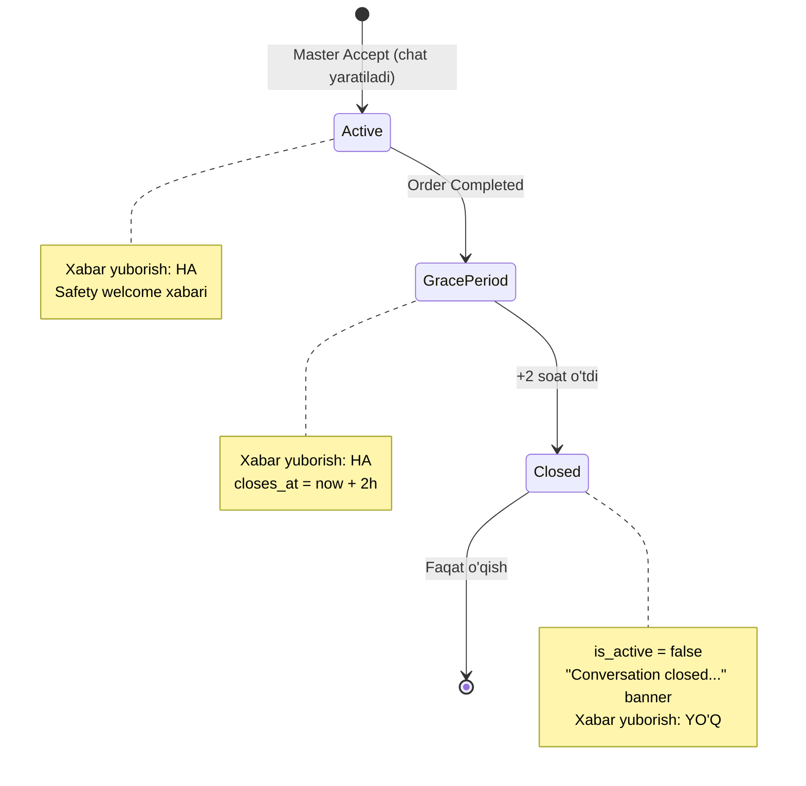

# Order chat — yopilish va xavfsizlik qoidalari

Master va mijoz (client) o‘rtasidagi chat buyurtma bilan bog‘lanadi. Bu hujjat **backend qanday ishlashini** tushuntiradi.

---

## Umumiy oqim



---

## 1. Chat qachon ochiladi?

**Master buyurtmani Accept qilganda** (`POST accept order`):

- `get_or_create_order_chat_room()` — master ↔ client 1:1 room
- `order.chat_room_id` saqlanadi
- **Yangi room** bo‘lsa — avtomatik **safety welcome** system xabar:

> *For your safety, we recommend keeping all communication and payments within AutoHandy…*

---

## 2. Order Completed — 2 soatlik grace period

Buyurtma **Completed** bo‘lganda:

- `schedule_order_chat_grace_period(order)` chaqiriladi
- `closes_at = now + 2 hours` (`.env`: `CHAT_CLOSE_HOURS_AFTER_ORDER_COMPLETE=2`)
- `is_active = true` — **hali yozish mumkin**

---

## 3. 2 soatdan keyin — chat yopiladi

| Holat | `is_active` | Yozish | Tarix |
|-------|-------------|--------|-------|
| Order davomida | `true` | ✅ | ✅ |
| Completed + 2 soat ichida | `true` | ✅ | ✅ |
| Completed + 2 soatdan keyin | `false` | ❌ | ✅ (o‘qish) |

Yopilganda avtomatik **system xabar** (bir marta):

> *Conversation closed. If you need further assistance, please contact AutoHandy Support.*

**Qanday tekshiriladi:**

- Har `GET messages` / `POST message` da lazy check
- Celery har **5 daqiqa**: `close_expired_chat_rooms_task`

**Yopiq chatga yozishga urinish:**

```json
HTTP 403
{ "error": "This conversation is closed. You can still read the history, but new messages cannot be sent." }
```

---

## 4. API maydonlari (mobil uchun)

### Room (`GET /api/chat/rooms/{id}/` yoki list)

| Maydon | Ma’nosi |
|--------|---------|
| `is_active` | `false` = yozish yopiq |
| `is_messaging_open` | Hozir yozish mumkinmi (grace hisobga olinadi) |
| `closes_at` | Yozish qachon yopiladi (ISO datetime) |

### Xabar (`GET messages`, WS, POST)

| Maydon | Ma’nosi |
|--------|---------|
| `is_system` | `true` = platforma xabari |
| `system_code` | `safety_welcome` / `contact_warning` / `conversation_closed` |
| `sender_type` | `system` — system xabarlar uchun |
| `sender` | `null` — system xabarlar uchun |

**Mobil UI:**

- `message_type === 'system'` yoki `is_system === true` → markaziy kulrang banner
- `is_messaging_open === false` → input disabled + pastda closed banner

---

## 5. Kontakt ma’lumotlari aniqlash

Har **text** xabar yuborilganda (REST yoki WebSocket):

- Telefon, email, URL, WhatsApp, Telegram, Signal, Messenger va hokazo qidiriladi
- Xabar **bloklanmaydi** — odatdagidek yuboriladi
- Keyin **contact_warning** system xabar ikkala tomonga ham chiqadi:

> *Warning: AutoHandy is not responsible for payments, services, disputes…*

Har safar kontakt topilsa — yangi warning (talab bo‘yicha).

---

## 6. API endpointlar

| Method | URL | Vazifa |
|--------|-----|--------|
| GET | `/api/chat/rooms/` | Chat ro‘yxati |
| POST | `/api/chat/rooms/` | Yangi chat (+ safety welcome) |
| GET | `/api/chat/rooms/{id}/` | Room detail + `is_messaging_open` |
| GET | `/api/chat/rooms/{id}/messages/` | Tarix (+ closed banner lazy) |
| POST | `/api/chat/rooms/{id}/messages/` | Xabar yuborish |
| WS | `/ws/chat/{room_id}/` | Real-time |

Buyurtma chat i: Accept → `order.chat_room_id`.

---

## 7. `.env`

```env
CHAT_CLOSE_HOURS_AFTER_ORDER_COMPLETE=2
```

---

## 8. Eski completed buyurtmalar (migratsiya)

Agar chat allaqachon completed order bilan bog‘langan, lekin `closes_at` bo‘lmasa:

- Birinchi `GET room/messages` da `sync_closes_at_from_completed_order()` — `order.updated_at + 2h`
- Agar vaqt o‘tgan bo‘lsa — darhol `is_active=false` + closed banner

---

## 9. Mobil checklist

- [ ] Room ochilganda `is_messaging_open` tekshirish
- [ ] `is_system` xabarlarni alohida UI da ko‘rsatish
- [ ] Input disable when `!is_messaging_open`
- [ ] 403 closed error handle
- [ ] Contact warning har safar ko‘rsatish (WS batch bilan kelishi mumkin)

---

## Bog‘liq kod

| Fayl | Vazifa |
|------|--------|
| `apps/chat/services.py` | Yopish, system xabarlar, welcome |
| `apps/chat/contact_detection.py` | Kontakt regex |
| `apps/chat/constants.py` | Matnlar |
| `apps/chat/tasks.py` | Celery sweep |
| `apps/order/api/views.py` | Accept → chat; Complete → grace |
