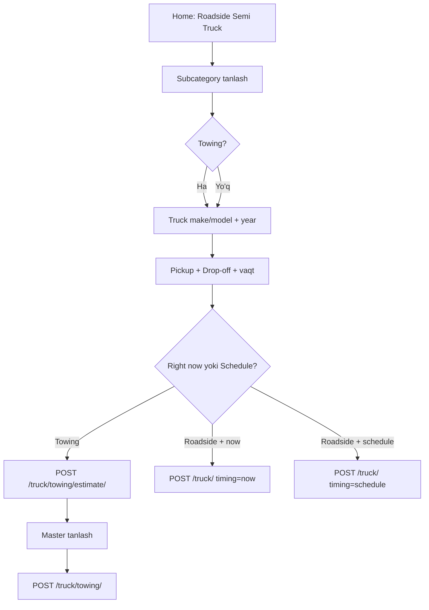

# Semi-Truck (Roadside Semi Truck) — Frontend hujjati

**Driver app** uchun yirik yuk mashinasi (semi-truck) roadside va towing oqimi.

**Base URL:** `https://api.autohandy.app`  
**Auth:** `Authorization: Bearer <access_token>` (buyurtma yaratishda majburiy)

---

## Muhim qoidalar

1. **Passenger car tanlanmaydi** — `car_list` yuborilmaydi. O‘rniga `truck_make_model` va ixtiyoriy `truck_year`.
2. **Truck katalogi alohida** — oddiy home screen kategoriyalaridan ajratilgan (`is_truck=true`).
3. **Semi-Truck Towing** va **oddiy Towing** — turli endpointlar (pastda jadval).
4. Subcategory nomlari admin da boshqacha bo‘lishi mumkin (`Tire Service` yoki `Semi-Truck Tire Replacement`). **`id` va `is_truck` ga tayaning**, nomga emas.

---

## Ekranlar bo‘yicha oqim



| Ekran (dizayn) | Backend |
|----------------|---------|
| Roadside Semi Truck | Main category (`is_truck=true`) |
| Semi-Truck Tire Replacement / Towing | Subcategory (`parent_id` = main id) |
| Truck make and model | `truck_make_model` |
| Year (optional) | `truck_year` |
| Pickup location | `location`, `latitude`, `longitude` |
| Drop-off (towing) | `delivery_location`, `delivery_latitude`, `delivery_longitude` |
| Right now | `timing: "now"` |
| Choose date and time | `timing: "schedule"` + `preferred_date` + `preferred_time_start` |
| Get estimate (towing) | `POST /api/order/truck/towing/estimate/` |
| Confirm | `POST /api/order/truck/towing/` yoki `POST /api/order/truck/` |

---

## 1. Kategoriyalarni olish

### Main category (home screen — truck bo‘limi)

```http
GET /api/categories/categories/?type=by_order&is_truck=true
```

**Javob (namuna):**

```json
[
  {
    "id": 101,
    "name": "Roadside Semi Truck",
    "icon": "https://api.autohandy.app/media/categories/icons/...",
    "type_category": "by_order",
    "parent": null,
    "is_truck": true,
    "sort_order": 15
  }
]
```

`id` ni saqlang — keyingi qadamda `parent_id` sifatida ishlatiladi.

### Subcategorylar

```http
GET /api/categories/subcategories/?parent_id=101
```

**Javob (namuna):**

```json
[
  {
    "id": 102,
    "name": "Semi-Truck Tire Replacement",
    "parent": 101,
    "is_truck": true
  },
  {
    "id": 103,
    "name": "Semi-Truck Towing",
    "parent": 101,
    "is_truck": true
  }
]
```

**Frontend logikasi:**

- Nomida `"towing"` bo‘lsa (case-insensitive) → **Semi-Truck Towing flow** (`/truck/towing/`).
- Qolganlari → **roadside flow** (`/truck/`).

---

## 2. Roadside xizmatlar (Tire, Jump Start, Fuel, …)

**Endpoint:** `POST /api/order/truck/`

Passenger car kerak emas. Yaqin atrofdagi masterlarga SOS navbat orqali yuboriladi.

### Request body

| Maydon | Majburiy | Tavsif |
|--------|----------|--------|
| `category_id` | Ha | Subcategory `id` (towing **bo‘lmasin**) |
| `truck_make_model` | Ha | Masalan: `Freightliner Cascadia` |
| `truck_year` | Yo‘q | `1900`–`2100` |
| `location` | Ha | Manzil matni |
| `latitude` | Ha | Pickup kenglik |
| `longitude` | Ha | Pickup uzunlik |
| `timing` | Yo‘q | `now` (default) yoki `schedule` |
| `preferred_date` | Schedule da | `YYYY-MM-DD` |
| `preferred_time_start` | Schedule da | `HH:MM` yoki `HH:MM:SS` |
| `text` | Yo‘q | Qo‘shimcha izoh |

### Right now

```json
POST /api/order/truck/
{
  "category_id": 102,
  "truck_make_model": "Freightliner Cascadia",
  "truck_year": 2018,
  "location": "I-80 mile 120, CA",
  "latitude": 41.311100,
  "longitude": -121.279700,
  "timing": "now"
}
```

### Schedule

```json
POST /api/order/truck/
{
  "category_id": 102,
  "truck_make_model": "Freightliner Cascadia",
  "truck_year": 2018,
  "location": "I-80 mile 120, CA",
  "latitude": 41.311100,
  "longitude": -121.279700,
  "timing": "schedule",
  "preferred_date": "2026-06-10",
  "preferred_time_start": "08:00"
}
```

### Muvaffaqiyatli javob `201`

```json
{
  "message": "Your semi-truck request has been sent to nearby providers",
  "order": {
    "id": 456,
    "order_type": "sos",
    "status": "pending",
    "truck": {
      "make_model": "Freightliner Cascadia",
      "year": 2018
    },
    "location": "I-80 mile 120, CA",
    "preferred_date": null,
    "preferred_time_start": null,
    "car_data": []
  }
}
```

### Xatoliklar `400`

| Xabar | Sabab |
|-------|-------|
| `Use POST /api/order/truck/towing/ for semi-truck towing.` | Towing subcategory uchun noto‘g‘ri endpoint |
| `No semi-truck service providers are available near this location...` | Yaqinda master yo‘q |
| `preferred_date and preferred_time_start are required when timing=schedule.` | Schedule to‘ldirilmagan |

---

## 3. Semi-Truck Towing

Ikki bosqich: **estimate** → **create**.  
Narx: **`service_type=semi_truck`** — master towing pricing da alohida `base_fee` + `price_per_mile`.

### 3.0 Master — narx sozlash

```http
GET /api/master/towing-pricing/
PUT /api/master/towing-pricing/
```

`services[]` ichida **`semi_truck`** qatori:

```json
{
  "master_id": 5,
  "services": [
    {
      "service_type": "semi_truck",
      "base_fee": 200,
      "price_per_mile": 6,
      "is_active": true
    }
  ]
}
```

**Formula:** `total = base_fee + (distance_miles × price_per_mile)`  
Semi-truck towing **service-items** orqali emas — faqat towing pricing orqali.

### 3.1 Narx va masterlar ro‘yxati (Driver)

```http
POST /api/order/truck/towing/estimate/
```

`service_type` yuborilmaydi — backend avtomatik `semi_truck` ishlatadi.

```json
{
  "latitude": 41.311100,
  "longitude": -121.279700,
  "delivery_latitude": 41.350000,
  "delivery_longitude": -121.300000
}
```

Yoki masofani qo‘lda:

```json
{
  "latitude": 41.311100,
  "longitude": -121.279700,
  "distance_miles": "25.00"
}
```

Javobda `service_type: "semi_truck"` va `masters[]` (har birida `pricing.total_price`).

### 3.2 Buyurtma yaratish

**Endpoint:** `POST /api/order/truck/towing/`

| Maydon | Majburiy | Tavsif |
|--------|----------|--------|
| `category_id` | Ha | Semi-Truck **Towing** subcategory id |
| `master_id` | Ha | Estimate dan tanlangan master |
| `truck_make_model` | Ha | Truck nomi |
| `truck_year` | Yo‘q | Yil |
| `location` | Ha | Pickup manzil |
| `latitude` | Ha | Pickup lat |
| `longitude` | Ha | Pickup lon |
| `delivery_location` | Yo‘q | Drop-off manzil matni |
| `delivery_latitude` | Ha* | Drop-off lat |
| `delivery_longitude` | Ha* | Drop-off lon |
| `distance_miles` | Ha* | *Yoki delivery koordinatalari |
| `timing` | Yo‘q | `now` yoki `schedule` |
| `preferred_date` | Schedule da | Sana |
| `preferred_time_start` | Schedule da | Vaqt |
| `text` | Yo‘q | Izoh |

```json
POST /api/order/truck/towing/
{
  "category_id": 103,
  "master_id": 5,
  "truck_make_model": "Kenworth T680",
  "truck_year": 2020,
  "location": "Highway pickup",
  "latitude": 41.311100,
  "longitude": -121.279700,
  "delivery_location": "Repair shop",
  "delivery_latitude": 41.350000,
  "delivery_longitude": -121.300000,
  "timing": "now"
}
```

### Muvaffaqiyatli javob `201`

```json
{
  "message": "Your semi-truck towing order has been sent to the selected master",
  "order": {
    "id": 789,
    "order_type": "towing",
    "status": "pending",
    "truck": {
      "make_model": "Kenworth T680",
      "year": 2020
    },
    "towing": {
      "pickup": { "location": "Highway pickup", "latitude": "41.311100", "longitude": "-121.279700" },
      "delivery": { "location": "Repair shop", "latitude": "41.350000", "longitude": "-121.300000" },
      "distance_miles": "2.45",
      "total_price": "162.25",
      "service_type": "semi_truck"
    },
    "car_data": []
  }
}
```

---

## 4. Oddiy Towing vs Semi-Truck Towing

| | Oddiy Towing (yengil avto) | Semi-Truck Towing |
|---|---------------------------|-------------------|
| Kategoriya | `is_towing_entry=true` main | `is_truck=true` subcategory (Towing) |
| Transport | `car_list` (mashina profili) | `truck_make_model`, `truck_year` |
| Estimate | `POST /api/order/towing/estimate/` + `service_type` | `POST /api/order/truck/towing/estimate/` (`semi_truck`) |
| Create | `POST /api/order/towing/` | `POST /api/order/truck/towing/` |
| Master narx | `services[].local` … `motorcycle` | `services[].semi_truck` |
| Katalog | `GET /categories/?type=by_order` (truck yashirin) | `GET /categories/?is_truck=true` |

**Semi-Truck bo‘limida `car_list` yubormang.**

---

## 5. Master app — buyurtmada ko‘rinadigan ma’lumotlar

Order detail (`GET /api/order/...`) da:

```json
{
  "truck": {
    "make_model": "Freightliner Cascadia",
    "year": 2018
  },
  "category_data": [
    {
      "parent": { "id": 101, "name": "Roadside Semi Truck" },
      "items": [{ "id": 102, "name": "Semi-Truck Tire Replacement" }]
    }
  ],
  "location": "Pickup manzil",
  "preferred_date": "2026-06-10",
  "preferred_time_start": "08:00:00",
  "towing": { ... }
}
```

- **Towing** buyurtmada: `towing.pickup`, `towing.delivery`, `towing.total_price`.
- **Schedule** buyurtmada: `preferred_date` + `preferred_time_start`.
- **Right now** da: `preferred_date` / `preferred_time_start` odatda `null`.

---

## 6. UI checklist

- [ ] Home screen da truck kategoriyasi: `?type=by_order&is_truck=true`
- [ ] Subcategory: `?parent_id={main_id}`
- [ ] Truck ekrani: `truck_make_model` majburiy, `truck_year` ixtiyoriy
- [ ] Passenger car picker **ko‘rsatilmasin**
- [ ] Towing subcategory → estimate + master tanlash + `/truck/towing/`
- [ ] Boshqa subcategory → `/truck/` (`timing` now / schedule)
- [ ] Order detail da `order.truck` blokini ko‘rsatish
- [ ] Xato: provider yo‘q → foydalanuvchiga tushunarli xabar

---

## 7. Bog‘liq hujjatlar

- [TOWING_FRONTEND.md](./TOWING_FRONTEND.md) — towing estimate va narx formulasi
- [TOWING.md](./TOWING.md) — backend towing arxitekturasi

---

## 8. Deploy eslatmasi

Serverda migration kerak:

```bash
python3 manage.py migrate
# order.0058_order_truck_fields — truck_make_model, truck_year
```
