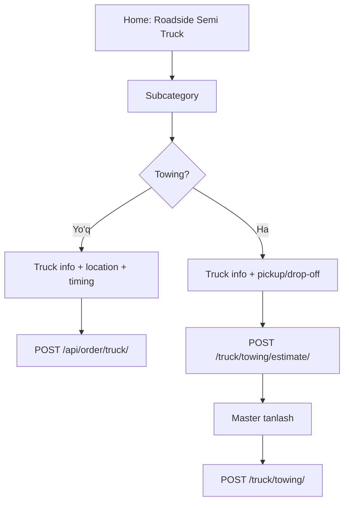

# Roadside Semi Truck — Frontend hujjati

**Driver** va **Master** ilovalari uchun yirik yuk mashinasi (semi-truck) xizmatlari.

**Base URL:** `https://api.autohandy.app`  
**Auth:** `Authorization: Bearer <access_token>`

**Oxirgi yangilanish:** 2026-06-23

---

## Qisqa xulosa

| Bo‘lim | Driver | Master |
|--------|--------|--------|
| Katalog | `?is_truck=true` | Tire, Fuel, … → **service-items**; Towing → **towing-pricing** (`semi_truck`) |
| Transport | `truck_make_model` + `truck_year` | — |
| Passenger car | **Yo‘q** (`car_list` ishlatilmaydi) | — |

**Formula (semi-truck towing):** `total = base_fee + (distance_miles × price_per_mile)`

---

## 1. Kategoriyalar (Driver)

### Main category

```http
GET /api/categories/categories/?type=by_order&is_truck=true
```

Oddiy home screen (`is_truck` siz) truck kategoriyalarni **yashiradi**.

**Javob (namuna):**

```json
[
  {
    "id": 101,
    "name": "Roadside Semi Truck",
    "type_category": "by_order",
    "parent": null,
    "is_truck": true,
    "sort_order": 15
  }
]
```

### Subcategorylar

```http
GET /api/categories/subcategories/?parent_id=101
```

**Javob (namuna):**

```json
[
  { "id": 102, "name": "Semi-Truck Tire Replacement", "parent": 101, "is_truck": true },
  { "id": 103, "name": "Semi-Truck Towing", "parent": 101, "is_truck": true }
]
```

**Frontend logikasi:**

- Nomida `"towing"` bor (case-insensitive) → **Towing flow** (estimate + create)
- Qolganlari → **Roadside flow** (`POST /api/order/truck/`)

> Admin da nomlar boshqacha bo‘lishi mumkin (`Tire Service`, `Towing`). **`id`** va **`is_truck`** ga tayaning.

---

## 2. Driver — Truck ma’lumoti (umumiy)

Barcha semi-truck buyurtmalarda:

| Maydon | Majburiy | Tavsif |
|--------|----------|--------|
| `truck_make_model` | Ha | Masalan: `Freightliner Cascadia` |
| `truck_year` | Yo‘q | `1900`–`2100` |

`car_list` **yuborilmaydi**.

Order javobida:

```json
"truck": {
  "make_model": "Freightliner Cascadia",
  "year": 2018
},
"car_data": []
```

---

## 3. Driver — Roadside (Tire, Jump Start, Fuel, …)

**Endpoint:** `POST /api/order/truck/`

Yaqin masterlarga SOS navbat orqali yuboriladi.

### Request

| Maydon | Majburiy | Tavsif |
|--------|----------|--------|
| `category_id` | Ha | Towing **bo‘lmagan** subcategory id |
| `truck_make_model` | Ha | Truck nomi |
| `truck_year` | Yo‘q | Yil |
| `location` | Ha | Manzil matni |
| `latitude` | Ha | GPS |
| `longitude` | Ha | GPS |
| `timing` | Yo‘q | `now` (default) yoki `schedule` |
| `preferred_date` | Schedule | `YYYY-MM-DD` |
| `preferred_time_start` | Schedule | `HH:MM` |
| `text` | Yo‘q | Izoh |

### Right now

```json
POST /api/order/truck/
{
  "category_id": 102,
  "truck_make_model": "Freightliner Cascadia",
  "truck_year": 2018,
  "location": "I-80 mile 120, CA",
  "latitude": 41.311100,
  "longitude": -121.279700,
  "timing": "now"
}
```

### Schedule

```json
POST /api/order/truck/
{
  "category_id": 102,
  "truck_make_model": "Freightliner Cascadia",
  "location": "I-80 mile 120, CA",
  "latitude": 41.311100,
  "longitude": -121.279700,
  "timing": "schedule",
  "preferred_date": "2026-06-10",
  "preferred_time_start": "08:00"
}
```

### Javob `201`

```json
{
  "message": "Your semi-truck request has been sent to nearby providers",
  "order": {
    "id": 456,
    "order_type": "sos",
    "status": "pending",
    "truck": { "make_model": "Freightliner Cascadia", "year": 2018 }
  }
}
```

---

## 4. Driver — Semi-Truck Towing

Ikki qadam: **estimate** → **create**.

### 4.1 Estimate

```http
POST /api/order/truck/towing/estimate/
```

`service_type` **yuborilmaydi** — backend `semi_truck` ishlatadi.

```json
{
  "latitude": 41.311100,
  "longitude": -121.279700,
  "delivery_latitude": 41.350000,
  "delivery_longitude": -121.300000
}
```

Yoki masofa qo‘lda:

```json
{
  "latitude": 41.311100,
  "longitude": -121.279700,
  "distance_miles": "25.00"
}
```

Ixtiyoriy: `radius_miles` (1–200, default server sozlamasi).

**Javob `200` (namuna):**

```json
{
  "service_type": "semi_truck",
  "service_label": "Semi-truck towing",
  "distance_miles": "25.00",
  "distance_source": "explicit_miles",
  "pricing_formula": "total = base_fee + (distance_miles × price_per_mile)",
  "master_count": 1,
  "masters": [
    {
      "master_id": 5,
      "master": { "id": 5, "name": "..." },
      "distance_to_pickup_miles": 2.5,
      "pricing": {
        "distance_miles": "25.00",
        "base_fee": "200.00",
        "price_per_mile": "6.00",
        "mileage_charge": "150.00",
        "total_price": "350.00",
        "formula": "200.00 + (25.00 × 6.00)",
        "service_type": "semi_truck"
      }
    }
  ]
}
```

`master_count === 0` bo‘lsa — yaqin atrofda `semi_truck` narx sozlagan master yo‘q.

### 4.2 Create

```http
POST /api/order/truck/towing/
```

| Maydon | Majburiy | Tavsif |
|--------|----------|--------|
| `category_id` | Ha | Semi-Truck Towing subcategory id |
| `master_id` | Ha | Estimate dan tanlangan |
| `truck_make_model` | Ha | Truck nomi |
| `truck_year` | Yo‘q | Yil |
| `location` | Ha | Pickup manzil |
| `latitude` | Ha | Pickup lat |
| `longitude` | Ha | Pickup lon |
| `delivery_location` | Yo‘q | Drop-off matn |
| `delivery_latitude` | Ha* | Drop-off lat |
| `delivery_longitude` | Ha* | Drop-off lon |
| `distance_miles` | Ha* | *Yoki delivery koordinatalari |
| `timing` | Yo‘q | `now` yoki `schedule` |
| `preferred_date` | Schedule | Sana |
| `preferred_time_start` | Schedule | Vaqt |
| `text` | Yo‘q | Izoh |

```json
POST /api/order/truck/towing/
{
  "category_id": 103,
  "master_id": 5,
  "truck_make_model": "Kenworth T680",
  "truck_year": 2020,
  "location": "Highway pickup",
  "latitude": 41.311100,
  "longitude": -121.279700,
  "delivery_location": "Repair shop",
  "delivery_latitude": 41.350000,
  "delivery_longitude": -121.300000,
  "timing": "now"
}
```

**Javob `201` (namuna):**

```json
{
  "message": "Your semi-truck towing order has been sent to the selected master",
  "order": {
    "id": 789,
    "order_type": "towing",
    "status": "pending",
    "truck": { "make_model": "Kenworth T680", "year": 2020 },
    "towing": {
      "pickup": { "location": "Highway pickup", "latitude": "41.311100", "longitude": "-121.279700" },
      "delivery": { "location": "Repair shop", "latitude": "41.350000", "longitude": "-121.300000" },
      "distance_miles": "25.00",
      "total_price": "350.00",
      "service_type": "semi_truck"
    }
  }
}
```

---

## 5. Master — Xizmatlar qo‘shish

### 5.1 Roadside (Tire, Jump Start, Fuel, Lockout, Repair)

Oddiy **service-items** API:

```http
POST /api/master/service-items/
```

```json
{
  "master_id": 5,
  "services": [
    { "category": 102, "price": 250 }
  ]
}
```

`category` — truck subcategory id (`is_truck=true`, towing emas).

**Semi-Truck Towing** bu yerda **qo‘shilmaydi** — xato qaytaradi.

### 5.2 Semi-Truck Towing narxi

```http
GET /api/master/towing-pricing/
PUT /api/master/towing-pricing/
```

`services[]` ichida **`semi_truck`** qatori:

```json
PUT /api/master/towing-pricing/
{
  "master_id": 5,
  "services": [
    {
      "service_type": "semi_truck",
      "base_fee": 200,
      "price_per_mile": 6,
      "is_active": true
    }
  ]
}
```

**GET javobida** barcha turlar chiqadi (`local`, `long_distance`, `accident_recovery`, `motorcycle`, `semi_truck`):

```json
{
  "master_id": 5,
  "configured": true,
  "pricing_formula": "total = base_fee + (distance_miles × price_per_mile)",
  "services": [
    {
      "service_type": "semi_truck",
      "label": "Semi-truck towing",
      "base_fee": "200.00",
      "price_per_mile": "6.00",
      "is_active": true,
      "configured": true,
      "examples": [
        {
          "distance_miles": "10.00",
          "total_price": "260.00",
          "label": "10.00 mi: $200.00 + (10.00 × $6.00) = $260.00"
        }
      ]
    }
  ]
}
```

Master UI da `examples[].label` ni ko‘rsatish mumkin.

---

## 6. Oddiy Towing vs Semi-Truck Towing

| | Oddiy Towing | Semi-Truck Towing |
|---|-------------|-------------------|
| Katalog | `GET /categories/?type=by_order` | `GET /categories/?is_truck=true` |
| Transport | `car_list` | `truck_make_model`, `truck_year` |
| Master narx | `local`, `long_distance`, … | `semi_truck` |
| Estimate | `POST /api/order/towing/estimate/` | `POST /api/order/truck/towing/estimate/` |
| Create | `POST /api/order/towing/` | `POST /api/order/truck/towing/` |

---

## 7. Oqim diagrammasi (Driver)



---

## 8. Xatoliklar

| HTTP | Xabar | Sabab |
|------|-------|-------|
| 400 | `Use POST /api/order/truck/towing/ for semi-truck towing.` | Towing subcategory uchun noto‘g‘ri endpoint |
| 400 | `No semi-truck service providers are available...` | Roadside: yaqin master yo‘q |
| 400 | `category_id must be the semi-truck Towing subcategory.` | Noto‘g‘ri category |
| 400 | `Semi-truck towing uses mileage pricing...` | Master towing ni service-items orqali qo‘shmoqchi |
| 200 + `master_count: 0` | note in response | Towing: `semi_truck` narx sozlagan master yo‘q |

---

## 9. UI checklist

### Driver
- [ ] Truck katalog: `?type=by_order&is_truck=true`
- [ ] Subcategory: `?parent_id={main_id}`
- [ ] Passenger car picker **yo‘q**
- [ ] Truck make/model majburiy, year ixtiyoriy
- [ ] Towing → estimate → master → create
- [ ] Roadside → `POST /truck/` (`timing`: now / schedule)
- [ ] Order detail: `order.truck` va `order.towing`

### Master
- [ ] Roadside xizmatlar: service-items (tire, fuel, …)
- [ ] Semi-truck towing: towing-pricing → `semi_truck` (base_fee + price_per_mile)
- [ ] Towing subcategory service-items ro‘yxatida **ko‘rinmasin**
- [ ] `examples` (10/20/50 mi) ko‘rsatish

---

## 10. API endpointlar ro‘yxati

| Method | URL | Kim |
|--------|-----|-----|
| GET | `/api/categories/categories/?type=by_order&is_truck=true` | Driver |
| GET | `/api/categories/subcategories/?parent_id={id}` | Driver |
| POST | `/api/order/truck/` | Driver — roadside |
| POST | `/api/order/truck/towing/estimate/` | Driver — towing narx |
| POST | `/api/order/truck/towing/` | Driver — towing buyurtma |
| GET | `/api/master/towing-pricing/` | Master |
| PUT | `/api/master/towing-pricing/` | Master |
| POST | `/api/master/service-items/` | Master — roadside |

---

## 11. Bog‘liq hujjatlar

- [TOWING_FRONTEND.md](./TOWING_FRONTEND.md) — oddiy towing (yengil avto)
- [TOWING.md](./TOWING.md) — backend arxitektura

---

## 12. Deploy

```bash
python3 manage.py migrate
# master.0039_semi_truck_towing_service_type
# order.0058_order_truck_fields
```
