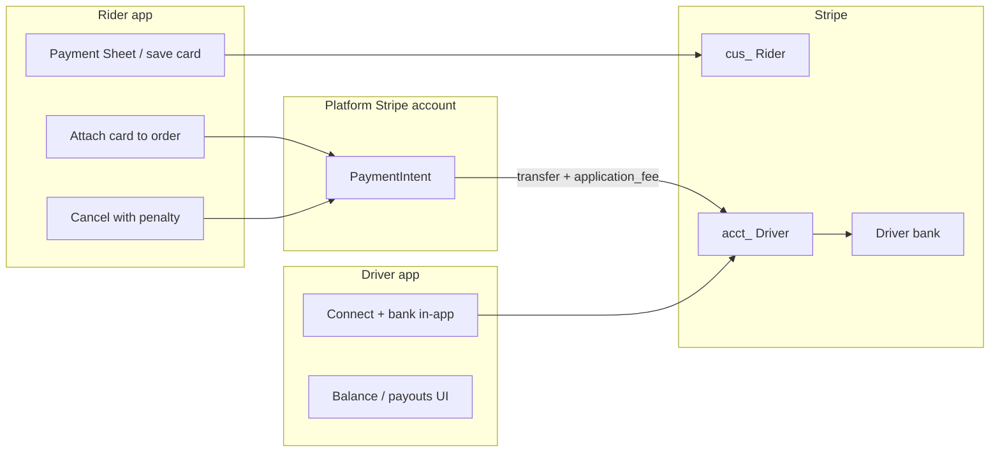

# Stripe integration — Driver & Rider (portable guide)

This document describes how **AutoHandy** implements Stripe for a two-sided marketplace. Use it when porting to another project.

## Terminology mapping (AutoHandy → your project)

| AutoHandy (this repo) | Your project | Role |
|----------------------|--------------|------|
| **Master** | **Driver** | Service provider; receives job payouts via **Stripe Connect** |
| **Driver / User / Client** | **Rider** | Customer; pays with **saved card** (Stripe Customer + PaymentMethod) |
| `master_profiles` | `driver_profiles` (example) | Profile linked to `User` |
| `stripe_connect_account_id` on Master | Same on Driver | `acct_…` Connect account |
| `stripe_customer_id` on User | Same on Rider | `cus_…` for cards |

Base URL examples below use AutoHandy paths. In your app, replace `/api/master/` → `/api/driver/` if you rename routes.

**Auth:** all endpoints require `Authorization: Bearer <JWT>` unless noted.

---

## Architecture overview



| Flow | Who | Stripe primitive |
|------|-----|------------------|
| Save card | Rider | Customer `cus_…` + PaymentMethod `pm_…` |
| Pay on job complete | Rider | Off-session **PaymentIntent** → Connect **destination charge** |
| Cancel fee | Rider | Off-session PaymentIntent (platform only, no transfer) |
| Get paid | Driver | Connect **Custom** account + external **bank** + automatic **payouts** |

**Important:** Drivers do **not** use saved-cards APIs. Riders do **not** use Connect bank APIs.

---

# Part 1 — Driver (Stripe Connect)

Drivers need a **Stripe Connect Custom** connected account (`acct_…`) with **in-app bank linking** (no Stripe-hosted onboarding page for customers). Payouts go to the driver’s bank on a schedule (e.g. weekly Monday).

## 1.1 Why Connect Custom + in-app bank?

- Marketplace: platform charges the rider; platform keeps fees; remainder goes to the driver’s Connect balance.
- Product requirement: bank form inside the app (routing + account), like direct deposit — not a redirect to Stripe onboarding for riders.
- `business_profile.url` must **not** be sent for this account controller type (Stripe returns `url_invalid`).

## 1.2 Backend services (reference)

| File | Purpose |
|------|---------|
| `apps/payment/services/stripe_connect_onboarding.py` | Create Connect account, payout schedule |
| `apps/payment/services/stripe_connect_bank.py` | Attach US bank, build payout profile |
| `apps/payment/services/stripe_connect_setup.py` | `Account.modify` — identity, TOS, enable charges/payouts |
| `apps/payment/services/connect_balance.py` | Read balance + recent payouts |
| `apps/payment/services/payout_day_notify.py` | Push on weekly payout anchor day |

## 1.3 Driver API endpoints

Prefix: **`/api/master/`** → in your project: **`/api/driver/`**

### GET `/api/master/stripe-connect/bank-account/`

**Who:** authenticated user with Driver (Master) role.

**Returns:** Direct deposit / payout screen payload:

- `stripe_connect_account_id` (`acct_…` or null)
- `onboarding_complete`, `charges_enabled`, `payouts_enabled`
- Masked bank: e.g. `STRIPE TEST BANK •••• 6789`
- `connected_account_agreement_url` (Stripe legal link for in-app checkbox)
- `requirements` (optional Stripe fields still due)

**Service:** `build_master_payout_profile(master)`

---

### POST `/api/master/stripe-connect/bank-account/`

**Who:** Driver.

**Purpose:** Create Connect account if missing, attach US bank, run setup so account can become **Enabled**.

**Body (JSON):**

| Field | Required | Notes |
|-------|----------|-------|
| `routing_number` | Yes | US ACH 9 digits. Test: `110000000` |
| `account_number` | Yes | Test: `000123456789` |
| `account_holder_name` | No | Defaults to user full name |
| `account_holder_type` | No | `individual` / `company` |
| `accept_agreement` | Yes | Must be `true` (Stripe Connected Account Agreement) |
| `dob_year`, `dob_month`, `dob_day` | Live | Test: server can default |
| `ssn_last4` | Live | 9-digit SSN to Stripe only; **not stored in DB** |

**Flow:**

1. `ensure_master_connect_and_add_bank()` — create `acct_` if needed, `create_external_account`
2. Auto-calls `complete_connect_account_setup()` — `individual`, TOS, MCC, descriptor
3. Saves `master.stripe_connect_account_id`

**Service:** `ensure_master_connect_and_add_bank`, `complete_connect_account_setup`

**Test vs live:**

- **Test** (`sk_test_…`): routing + account + `accept_agreement` often enough.
- **Live**: real bank, DOB, SSN; Stripe may still show “In review” in Dashboard.

---

### DELETE `/api/master/stripe-connect/bank-account/`

**Body (optional):** `{ "bank_account_id": "ba_…" }` — if omitted, deletes default bank.

---

### POST `/api/master/stripe-connect/complete-setup/`

**When:** Bank already linked but Connect still **Restricted** (charges/payouts not enabled).

**Body:** `accept_agreement`, optional `dob_*`, `ssn_last4` — same rules as POST bank (no new bank).

**Service:** `complete_connect_account_setup()`

---

### GET `/api/master/stripe-balance/`

**Who:** Driver.

**Returns:** Stripe Connect balance (read-only):

- `available`, `pending`, `instant_available`
- `recent_payouts`
- `payout_schedule_note`

**Requires:** `stripe_connect_account_id` on driver profile.

**Service:** `fetch_connect_balance_and_payouts()`

---

### GET `/api/master/checkout-history/`

**Who:** Driver.

**Returns:** Ledger-style lines from Connect account (charges, payouts, fees) for earnings history UI.

---

### Disabled / legacy (do not use for new apps)

| Endpoint | Status |
|----------|--------|
| `POST /api/master/stripe-connect/onboarding/` | Commented out — hosted Account Link |
| `GET/POST /api/master/stripe-connect/` | Commented out — manual `acct_` paste |

Use **bank-account** + **complete-setup** only.

---

## 1.4 Driver data model

| Field | Model | Description |
|-------|-------|-------------|
| `stripe_connect_account_id` | `Master` | `acct_…` after first bank save |

Bank account numbers and SSN are **never** stored in Django — only sent to Stripe API.

---

## 1.5 Payout schedule (automatic bank transfer)

Configured when Connect account is created/updated:

| Env variable | Default | Meaning |
|--------------|---------|---------|
| `STRIPE_CONNECT_PAYOUT_INTERVAL` | `weekly` | Stripe payout schedule |
| `STRIPE_CONNECT_PAYOUT_WEEKLY_ANCHOR` | `monday` | Day of week |
| `STRIPE_CONNECT_PAYOUT_DELAY_DAYS` | empty | Optional delay |
| `STRIPE_CONNECT_APPLY_PAYOUT_SCHEDULE` | `true` | Apply schedule on create |

**Push reminder (Celery):** on anchor day (e.g. every Monday), FCM to all drivers with `acct_…`:

- Task: `apps.payment.tasks.notify_masters_payout_day_task`
- Env: `STRIPE_CONNECT_PAYOUT_REMINDER_ENABLED`, `STRIPE_CONNECT_PAYOUT_REMINDER_HOUR`

---

## 1.6 When Driver gets money

1. Rider’s card is charged when Driver marks order **complete** (see Part 2).
2. Stripe **destination charge**: `transfer_data.destination = acct_…`, `application_fee_amount` = platform share.
3. Funds appear on Connect balance: **pending** → **available**.
4. Stripe **automatic payout** to linked bank per schedule (e.g. weekly Monday).

Driver does **not** trigger payout manually in API — Stripe handles it.

---

# Part 2 — Rider (Stripe Customer + card pay)

Riders pay by card only. No cash. No Connect.

## 2.1 Backend services (reference)

| File | Purpose |
|------|---------|
| `apps/payment/services/stripe_cards.py` | `ensure_stripe_customer_id`, save/detach PM |
| `apps/payment/services/checkout_fees.py` | Rider total, driver payout, fee breakdown |
| `apps/payment/services/order_charge.py` | Charge on order **complete** (Connect destination) |
| `apps/payment/services/cancellation_penalty_charge.py` | Charge cancel penalty (platform only) |
| `apps/order/services/client_cancel_penalty.py` | Cancel flow + penalty + push |

## 2.2 Rider API endpoints

### GET `/api/auth/stripe-customer/`

**Who:** any authenticated user (used by Rider app before Payment Sheet).

**Returns:**

```json
{
  "status": "success",
  "data": {
    "stripe_customer_id": "cus_…",
    "created": false,
    "stripe_publishable_key": "pk_…"
  }
}
```

**Service:** `ensure_stripe_customer_id(user)` — stores `user.stripe_customer_id`.

**Mobile:** use `stripe_publishable_key` + create/confirm PaymentMethod in Stripe SDK, then POST saved card.

---

### GET/POST `/api/payment/saved-cards/`

**Who:** Rider only. **403** if user is in Driver (Master) group.

| Method | Action |
|--------|--------|
| GET | List active cards (`holder_role=client`) |
| POST | `{ "payment_method_id": "pm_…", "stripe_customer_id": "cus_…" optional }` |

**Service:** `save_payment_method_for_user`

---

### PUT/DELETE `/api/payment/saved-cards/{id}/`

- PUT `{ "is_default": true }` — set default card  
- DELETE — detach card  

---

### PATCH `/api/order/{order_id}/payment-card/`

**Who:** order owner (Rider).

**Body:** `{ "card_id": 123 }`

Links `order.saved_card` and `payment_type=card` before complete.

---

### GET `/api/order/{order_id}/checkout-preview/`

**Who:** Rider (order owner) or assigned Driver.

**Returns:** `compute_marketplace_checkout(order)` — fee breakdown for UI.

---

### POST `/api/order/{order_id}/complete/`

**Who:** assigned Driver, with completion PIN.

**Payment (automatic):**

1. Requires `order.saved_card`
2. `charge_order_on_completion(order)` — PaymentIntent off-session
3. Amount = `customer_total` (job + fees + penalties)
4. `application_fee_amount` = platform fee; rest transfers to Driver `acct_…`

**Rider push:** order completed + amount charged (`order_completed`).

**Service:** `order_charge.charge_order_on_completion`

---

### POST `/api/order/{order_id}/cancel/`

**Who:** Rider or Driver (different rules).

**Rider cancel with penalty:**

1. `client_cancellation_snapshot(order)` — tier, percent, grace
2. If penalty applies → add `order_penalty_total`, charge card via `charge_cancellation_penalty`
3. Celery retries if charge fails: `charge_cancellation_penalty_task`

**Rider push:**

- `order_cancelled`
- `cancellation_penalty_charged` — “$X charged for cancelling…”

**Driver cancel:** no card charge; audit `MasterOrderCancellation`.

---

## 2.3 Rider data model

| Field | Model | Description |
|-------|-------|-------------|
| `stripe_customer_id` | `CustomUser` | `cus_…` |
| `saved_card` | `Order` FK | Card used for this order |
| `stripe_payment_*` | `Order` | PI id, status, amount after charge/penalty |
| `order_penalty_total` | `Order` | Accumulated cancel penalties |

---

## 2.4 Fee model (standard orders)

Configurable via `.env` / `settings.py`. Example **target** product spec:

| Line | Default env | Formula (job = `work_total`) |
|------|-------------|------------------------------|
| Rider app fee | `CUSTOMER_PLATFORM_FEE_PERCENT_SCHEDULED` (4%) | % of job |
| Rider service fee | `CUSTOMER_SERVICE_FEE_PERCENT_SCHEDULED` (4%) | % of job |
| Driver platform fee | `PROVIDER_PLATFORM_FEE_PERCENT` (10%) | withheld via Connect |
| **Rider pays** | — | job + rider fees + penalties |
| **Driver receives** | — | job × (100% − driver platform %) |

Client spec example: 7% + 3% rider fees, 10% from driver → `customer_total = job × 1.10`, driver gets `job × 0.90`.

**Preview:** always use `checkout-preview` or `marketplace_fees` on order detail — not only `pricing.total` (job price).

**Charge math:** `apps/payment/services/checkout_fees.py`  
**Stripe:** `application_fee_amount = charge_cents - master_payout_cents`

---

## 2.5 Cancellation penalties (Rider only)

**Config (`.env`):**

| Variable | Default | Meaning |
|----------|---------|---------|
| `CLIENT_CANCEL_GRACE_MINUTES_AFTER_ACCEPT` | 10 | Free cancel after accept |
| `CLIENT_CANCEL_PENALTY_PERCENT_ACCEPTED_LATE` | 10% | After grace |
| `CLIENT_CANCEL_PENALTY_PERCENT_ON_THE_WAY` | 15% | While driver en route |
| `CLIENT_CANCEL_NO_PENALTY_AFTER_ON_THE_WAY_HOURS` | 2 | Free after N hours on the way |
| `CLIENT_CANCEL_PENALTY_PERCENT_ARRIVED` | 25% | Driver arrived |
| `CLIENT_CANCEL_PENALTY_CHARGE_ENABLED` | true | Card charge on cancel |

**Logic:** `apps/order/services/status_workflow.py` → `cancellation` on order JSON.

**Penalty base:** `work_total × percent` (not including prior penalties in percent calc).

---

# Part 3 — End-to-end order payment flow

```
1. Rider creates order, selects Driver
2. Rider: GET stripe-customer → Payment Sheet → POST saved-cards
3. Rider: PATCH order payment-card { card_id }
4. Driver: POST stripe-connect/bank-account (once per driver)
5. Driver: accept → on_the_way → … → complete + PIN
6. Backend: charge_order_on_completion → Rider card, Driver Connect credit
7. Driver: GET stripe-balance (pending/available)
8. Stripe: weekly payout to Driver bank (anchor day)
```

---

# Part 4 — Environment variables (checklist)

```env
# Platform Stripe
STRIPE_SECRET_KEY=sk_test_…
STRIPE_PUBLISHABLE_KEY=pk_test_…
STRIPE_CHARGE_CURRENCY=usd

# Fees
PROVIDER_PLATFORM_FEE_PERCENT=10
CUSTOMER_SERVICE_FEE_PERCENT_SCHEDULED=4
CUSTOMER_PLATFORM_FEE_PERCENT_SCHEDULED=4

# Connect (Driver)
STRIPE_CONNECT_ACCOUNT_TYPE=custom
STRIPE_CONNECT_PAYOUT_INTERVAL=weekly
STRIPE_CONNECT_PAYOUT_WEEKLY_ANCHOR=monday
STRIPE_PLATFORM_MCC=7538
STRIPE_PLATFORM_STATEMENT_DESCRIPTOR=YOURAPP

# Rider cancel penalties
CLIENT_CANCEL_GRACE_MINUTES_AFTER_ACCEPT=10
CLIENT_CANCEL_PENALTY_PERCENT_ACCEPTED_LATE=10
CLIENT_CANCEL_PENALTY_PERCENT_ON_THE_WAY=15
CLIENT_CANCEL_PENALTY_PERCENT_ARRIVED=25
CLIENT_CANCEL_NO_PENALTY_AFTER_ON_THE_WAY_HOURS=2
CLIENT_CANCEL_PENALTY_CHARGE_ENABLED=true

# Payout day push (Driver)
STRIPE_CONNECT_PAYOUT_REMINDER_ENABLED=true
STRIPE_CONNECT_PAYOUT_REMINDER_HOUR=9

# Celery
CELERY_BROKER_URL=redis://127.0.0.1:6379/0
```

---

# Part 5 — Push notification kinds (FCM)

| kind | Audience | When |
|------|----------|------|
| `cancellation_penalty_charged` | Rider | Cancel fee charged |
| `order_completed` | Rider | Job complete + card charged (includes amount) |
| `payout_scheduled_today` | Driver | Weekly payout anchor day |

---

# Part 6 — Porting checklist

## Driver app

- [ ] Screen: Direct deposit — GET/POST/DELETE `stripe-connect/bank-account`
- [ ] Checkbox: Stripe Connected Account Agreement
- [ ] Optional: complete-setup if status restricted
- [ ] Screen: Balance & payouts — GET `stripe-balance`
- [ ] Do **not** call `saved-cards` APIs

## Rider app

- [ ] Onboarding: stripe-customer + save card
- [ ] Before pay: attach card to order (`payment-card`)
- [ ] Show `checkout-preview` / `marketplace_fees` totals
- [ ] Show `cancellation` rules on order detail
- [ ] Do **not** call Connect bank APIs

## Backend

- [ ] Stripe Connect Custom + `transfer_data` on complete charge
- [ ] Separate penalty charge (no destination) on cancel
- [ ] Celery: penalty retry + payout-day reminder
- [ ] Map URLs/groups: master→driver, client→rider

---

# Part 7 — Common errors

| Error | Cause | Fix |
|-------|-------|-----|
| `url_invalid` on Connect setup | Sent `business_profile.url` | Omit url entirely |
| Destination transfers inactive | Driver Connect not enabled | Bank + complete-setup |
| No saved card on complete | Rider did not attach card | PATCH payment-card |
| Saved cards 403 for Driver | Wrong API for role | Use Connect bank API |
| Cancel penalty not charged | No card / Stripe off | Save card; check `CLIENT_CANCEL_PENALTY_CHARGE_ENABLED` |

---

*Source: AutoHandy backend (`apps/payment`, `apps/master`, `apps/order`, `apps/accounts`). Swagger: `/docs/` when server runs.*
