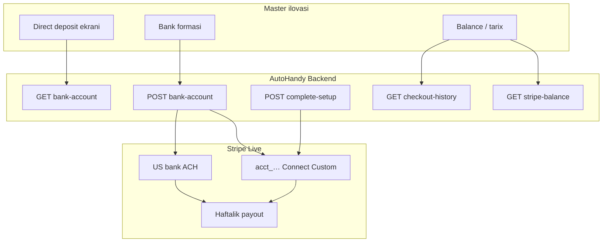
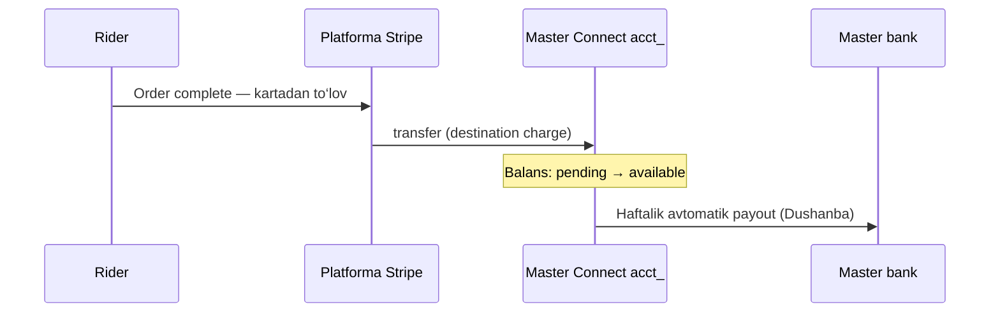

# Stripe Connect — Master (Live rejim)

Master (driver) pulni **Stripe Connect** orqali bank hisobiga oladi. Bu hujjat **live** rejimda nima qilinganini, qaysi API ishlatilishini va hozir nima kerakligini tushuntiradi.

> **Eslatma:** Bu oqimda **Stripe Identity shart emas** (hujjat/selfie alohida). Asosiy yo‘l — ilova ichida **bank + DOB + SSN** yuborish va Connect account yoqish.

---

## Umumiy sxema



| Kim | Nima qiladi |
|-----|-------------|
| **Rider** | Kartadan to‘laydi (Stripe Customer — boshqa API) |
| **Platforma (AutoHandy)** | To‘lovni qabul qiladi, master ulushini Connect ga **transfer** qiladi |
| **Master** | Connect account + bank ulaydi, haftalik **direct deposit** oladi |

Master **saved card** API larini ishlatmaydi — faqat Connect.

---

## Live rejimga nima qildik?

### 1. Backend (`.env`)

| O‘zgaruvchi | Qiymat | Ma’nosi |
|-------------|--------|---------|
| `STRIPE_SECRET_KEY` | `sk_live_…` | Live API |
| `STRIPE_PUBLISHABLE_KEY` | `pk_live_…` | Mobil SDK uchun |
| `STRIPE_CONNECT_ACCOUNT_TYPE` | `custom` | Bank ilova ichida (API), Stripe hosted emas |
| `STRIPE_CONNECT_ACCOUNT_DEFAULT_COUNTRY` | `US` | US ACH bank |
| `STRIPE_CONNECT_PAYOUT_INTERVAL` | `weekly` | Haftalik to‘lov |
| `STRIPE_CONNECT_PAYOUT_WEEKLY_ANCHOR` | `monday` | Dushanba |
| `STRIPE_CHARGE_CURRENCY` | `usd` | USD |

**Identity ishlatmaslik uchun** (ixtiyoriy):

```env
STRIPE_IDENTITY_ENFORCE_BEFORE_PAYOUT=false
```

### 2. Kod tuzatishlari

| O‘zgarish | Fayl | Sabab |
|-----------|------|-------|
| Live’da SSN `0000` yuborilmasligi | `stripe_connect_setup.py` | Live Stripe fake SSN ni rad etadi |
| SSN bo‘lmasa aniq 400 xato | `stripe_connect_setup.py` | Mobil jamoaga tushunarli xabar |
| Swagger live misollari (DOB + SSN) | `stripe_connect_bank_view.py` | API hujjati yangilandi |

### 3. Stripe Dashboard (platforma egasi)

| Qadam | Holat |
|-------|--------|
| Connect **Platform profile** to‘ldirish | ✅ |
| **Ongoing seller compliance** — Acknowledge | ✅ |
| Live mode ON | Tekshiring |

Dashboard’dan qo‘lda yaratilgan `connect.stripe.com/...` link **backendga kerak emas** — masterlar ilovadan o‘tadi.

### 4. Test → Live o‘tishda tozalash

Test va live **alohida**. Eski ID lar ishlamaydi:

| DB maydon | Test dan qolgan bo‘lsa |
|-----------|------------------------|
| `master.stripe_connect_account_id` | `NULL` qiling, qayta bank ulang |
| `user.stripe_customer_id` (rider) | `NULL` — rider kartasi uchun |

---

## Master API — hozir ishlatiladigan endpointlar

**Prefix:** `/api/master/`  
**Auth:** `Authorization: Bearer <master JWT>`

### Asosiy oqim (Direct deposit)

| # | Method | URL | Vazifa |
|---|--------|-----|--------|
| 1 | **GET** | `/api/master/stripe-connect/bank-account/` | Holat: bank maskasi, Connect status, agreement URL |
| 2 | **POST** | `/api/master/stripe-connect/bank-account/` | Bank ulash + Connect account yaratish/yoqish |
| 3 | **POST** | `/api/master/stripe-connect/complete-setup/` | Bank bor, lekin account hali **Restricted** bo‘lsa |

### Balans va daromad

| # | Method | URL | Vazifa |
|---|--------|-----|--------|
| 4 | **GET** | `/api/master/stripe-balance/` | Connect balans + so‘nggi payout lar |
| 5 | **GET** | `/api/master/checkout-history/` | Tranzaksiyalar tarixi (UI ledger) |

### Ishlatilmaydi (legacy, comment qilingan)

| URL | Sabab |
|-----|-------|
| `/api/master/stripe-connect/onboarding/` | Stripe hosted sahifa — bizda kerak emas |
| `/api/master/stripe-connect/` | Qo‘lda `acct_` link |

### Identity (hozir sizga shart emas)

| URL | Izoh |
|-----|------|
| `/api/master/stripe-identity/status/` | Faqat Identity yoqilgan bo‘lsa |
| `/api/master/stripe-identity/start/` | `.env` da `ENFORCE=false` bo‘lsa bank oqimiga ta’sir qilmaydi |

---

## Mobil oqim (ketma-ket)

```
┌──────────────────────────────────────────────────────────────┐
│  1. GET  /stripe-connect/bank-account/                       │
│     → onboarding_complete, bank_account, agreement URL       │
├──────────────────────────────────────────────────────────────┤
│  2. Agar bank yo‘q → POST /stripe-connect/bank-account/      │
│     → routing, account, accept_agreement, DOB, SSN (live)    │
├──────────────────────────────────────────────────────────────┤
│  3. Agar Restricted → POST /stripe-connect/complete-setup/   │
├──────────────────────────────────────────────────────────────┤
│  4. GET /stripe-balance/  — balans ekrani                    │
│  5. GET /checkout-history/ — daromad tarixi                  │
└──────────────────────────────────────────────────────────────┘
```

---

## POST body — Test vs Live

### Test rejim (`sk_test_…`)

Minimal yetarli:

```json
{
  "routing_number": "110000000",
  "account_number": "000123456789",
  "accept_agreement": true
}
```

DOB va SSN server avtomatik to‘ldiradi.

### Live rejim (`sk_live_…`) — **majburiy maydonlar**

```json
{
  "routing_number": "121000358",
  "account_number": "XXXXXXXX",
  "account_holder_name": "Anton Kolesnikov",
  "account_holder_type": "individual",
  "accept_agreement": true,
  "dob_year": 1987,
  "dob_month": 3,
  "dob_day": 2,
  "ssn_last4": "123456789"
}
```

| Maydon | Live | Izoh |
|--------|------|------|
| `routing_number` | ✅ | Haqiqiy US bank (9 raqam) |
| `account_number` | ✅ | Haqiqiy hisob |
| `accept_agreement` | ✅ | Stripe Connected Account Agreement |
| `dob_year/month/day` | ✅ | Tug‘ilgan sana |
| `ssn_last4` | ✅ | **9 raqamli** US SSN (nom `ssn_last4`, lekin to‘liq SSN) |

SSN va DOB **DB da saqlanmaydi** — faqat Stripe API ga ketadi.

---

## GET bank-account — muhim javob maydonlari

```json
{
  "stripe_connect_account_id": "acct_…",
  "stripe_publishable_key": "pk_live_…",
  "connected_account_agreement_url": "https://stripe.com/legal/connect-account",
  "onboarding_complete": true,
  "bank_account": {
    "bank_name": "BANK OF AMERICA",
    "last4": "6789"
  },
  "weekly_direct_deposit": {
    "enabled": true,
    "fee_note": "No fee"
  },
  "account": {
    "charges_enabled": true,
    "payouts_enabled": true,
    "details_submitted": true
  },
  "requirements": null
}
```

Mobil ekranda:

- `connected_account_agreement_url` — checkbox oldidagi link
- `onboarding_complete` — payout tayyorligi
- `requirements.needs_additional_setup` — qo‘shimcha ma’lumot kerak bo‘lsa

---

## Backend ichida qaysi servislar ishlaydi

| Fayl | Vazifa |
|------|--------|
| `stripe_connect_onboarding.py` | `acct_…` yaratish (Custom), payout schedule |
| `stripe_connect_bank.py` | Bank biriktirish, payout profile |
| `stripe_connect_setup.py` | DOB, SSN, TOS — account yoqish |
| `connect_balance.py` | Balans + payout o‘qish |
| `order_charge.py` | Buyurtma tugaganda rider kartasidan pul → master Connect ga transfer |

Master profilida saqlanadigan yagona Stripe ID:

```
master.stripe_connect_account_id = acct_…
```

---

## Pul qanday oqadi?



Master payout ni qo‘lda chaqirmaydi — Stripe schedule bo‘yicha bankka yuboradi.

---

## `.env` — live uchun to‘liq namuna (Master qismi)

```env
# Live kalitlar
STRIPE_SECRET_KEY=sk_live_…
STRIPE_PUBLISHABLE_KEY=pk_live_…

# Connect
STRIPE_CONNECT_ACCOUNT_TYPE=custom
STRIPE_CONNECT_ACCOUNT_DEFAULT_COUNTRY=US
STRIPE_CONNECT_PAYOUT_INTERVAL=weekly
STRIPE_CONNECT_PAYOUT_WEEKLY_ANCHOR=monday
STRIPE_CONNECT_APPLY_PAYOUT_SCHEDULE=true

# Platforma
STRIPE_CHARGE_CURRENCY=usd
STRIPE_PLATFORM_MCC=7538
STRIPE_PLATFORM_STATEMENT_DESCRIPTOR=AUTOHANDY
STRIPE_PLATFORM_PRODUCT_DESCRIPTION=On-demand automotive services
STRIPE_PLATFORM_BUSINESS_URL=https://your-real-site.com

# Identity — master bank uchun SHART EMAS
STRIPE_IDENTITY_ENFORCE_BEFORE_PAYOUT=false

# Webhook (ixtiyoriy)
# STRIPE_WEBHOOK_SECRET=whsec_…
```

---

## Tez-tez uchraydigan xatolar

| Xato | Sabab | Yechim |
|------|-------|--------|
| *Please review responsibilities… platform-profile* | Dashboard profile tasdiqlanmagan | Platform profile → Acknowledge |
| *Invalid SSN last 4. 0000 is not allowed* | Test SSN live’da | 9 raqamli haqiqiy SSN yuboring |
| *US SSN is required in live mode* | `ssn_last4` bo‘sh | POST body ga SSN qo‘shing |
| *No such customer cus_…* | Rider test `cus_` live da | DB dan `stripe_customer_id` tozalang |
| Bank bor, lekin Restricted | Setup tugallanmagan | `POST complete-setup/` |
| Stripe hosted sahifa ochiladi | Eski Express account | `stripe_connect_account_id` tozalang, qayta POST |

---

## Hozir nima qilish kerak? (checklist)

### Platforma (siz)

- [ ] Live kalitlar `.env` da
- [ ] Platform profile **Completed**
- [ ] `STRIPE_PLATFORM_BUSINESS_URL` — haqiqiy sayt
- [ ] `STRIPE_IDENTITY_ENFORCE_BEFORE_PAYOUT=false` (Identity kerak emas bo‘lsa)
- [ ] Backend restart
- [ ] Test dan qolgan `acct_…` / `cus_…` tozalash

### Mobil jamoa

- [ ] `pk_live_…` ishlatish (test emas)
- [ ] Direct deposit ekrani: bank + DOB + SSN (live)
- [ ] Agreement checkbox + `accept_agreement: true`
- [ ] `GET bank-account` → holat ko‘rsatish
- [ ] Balans: `GET stripe-balance/`

### Master (foydalanuvchi)

- [ ] Haqiqiy US bank rekvizitlari
- [ ] Haqiqiy DOB va SSN
- [ ] Agreement ga rozilik

---

## Swagger

Hujjat: `/api/schema/swagger-ui/`

Qidirish:

- **Stripe — Master** tag
- `POST stripe-connect/bank-account` — misol: *Live mode — bank + DOB + SSN*
- `POST stripe-connect/complete-setup` — misol: *Live mode — DOB + SSN (required)*

---

## Bog‘liq hujjatlar

- [STRIPE_MASTER_EARNINGS_BALANCE.md](./STRIPE_MASTER_EARNINGS_BALANCE.md) — pul oqimi, pending/available balans, checkout history
- [STRIPE_MASTER_IDENTITY.md](./STRIPE_MASTER_IDENTITY.md) — Identity (ixtiyoriy)

