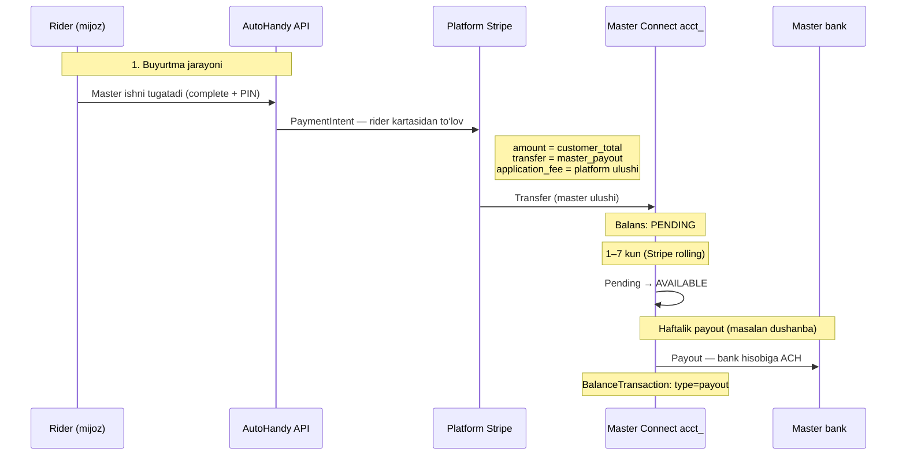
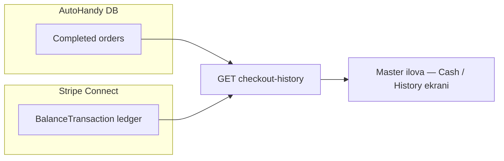

# Master — pul oqimi, balans va checkout history

Master qanday pul topadi, **pending / available** balans nima, **checkout history** qanday ishlaydi — barchasi shu hujjatda.

---

## Qisqa javob

| Savol | Javob |
|-------|--------|
| Pul qachon tushadi? | Buyurtma **completed** bo‘lganda rider kartasidan yechiladi |
| Master balansiga qachon keladi? | Stripe Connect `acct_…` ga **transfer** — avval **pending**, keyin **available** |
| Bankka qachon tushadi? | **Available** balans Stripe jadvali bo‘yicha (odatda **haftalik dushanba**) |
| Checkout history nima? | Tugallangan buyurtmalar (DB) + Stripe ledger (BalanceTransaction) |

---

## To‘liq pul oqimi (diagramma)



---

## 1-qadam: Buyurtma tugashi — kartadan yechish

**Qachon:** Master buyurtmani **complete** qilganda (PIN tasdiqlangandan keyin).

**Kod:** `charge_order_on_completion(order)` — `apps/payment/services/order_charge.py`

**Stripe:** `PaymentIntent.create` — **destination charge**:

| Parametr | Ma’nosi |
|----------|---------|
| `amount` | Rider to‘laydigan **to‘liq summa** (`customer_total`) |
| `transfer_data.destination` | Master `acct_…` |
| `application_fee_amount` | Platforma ushlab qoladigan qism |

### Pul qanday bo‘linadi?

Asosiy formula (`checkout_fees.py`):

```
technician_total = ish narxi (chegirmadan keyin)
master_payout    = technician_total × (100% - PROVIDER_PLATFORM_FEE_PERCENT)
                   # default: 90% master, 10% platforma (master tomondan)

customer_total   = technician + dispatch + service + platform fee + penalty
                   # rider shu summani to‘laydi

application_fee  = customer_total - master_payout
                   # platforma + rider fee lar birgalikda
```

**Misol** (scheduled, `$100` ish, 10% master platform fee, 4%+4% client fee):

| Kim | Summa |
|-----|-------|
| Rider to‘laydi | ~$108 (+ penalty bo‘lsa qo‘shiladi) |
| Master Connect ga transfer | **$90** |
| Platforma ushlab qoladi | ~$18 |

> Master payout faqat **technician_total** dan hisoblanadi — penalty master payout formulasiga kirmaydi.

---

## 2-qadam: Connect balans — Pending vs Available

Master puli **bank emas**, avval **Stripe Connect balansi**ga tushadi.

**API o‘qish:** `GET /api/master/stripe-balance/`  
**Servis:** `fetch_connect_balance_and_payouts()`

### Javob maydonlari

```json
{
  "stripe_connect_account_id": "acct_…",
  "livemode": true,
  "available": [
    { "currency": "USD", "amount_cents": 4500, "amount": "45.00" }
  ],
  "pending": [
    { "currency": "USD", "amount_cents": 9000, "amount": "90.00" }
  ],
  "instant_available": [],
  "recent_payouts": [
    {
      "id": "po_…",
      "amount_cents": 4500,
      "amount": "45.00",
      "status": "paid",
      "arrival_date": "2026-06-02T00:00:00+00:00"
    }
  ],
  "payout_schedule_note": "…"
}
```

### Pending nima?

| Holat | Ma’nosi |
|-------|---------|
| **pending** | Pul Connect accountga **tushgan**, lekin hali **bankka yoki payout uchun ochiq emas** |
| **available** | Pul **bank payout** yoki boshqa yechish uchun **tayyor** |
| **instant_available** | Tezkor payout (agar Stripe ruxsat bersa; ko‘pincha bo‘sh) |

Stripe kartadan olingan pulni qisqa muddat **pending** da ushlab turadi (odatda **2–7 kun**, mamlakat va risk bo‘yicha). Keyin avtomatik **available** ga o‘tadi.

```
Order complete → Transfer → PENDING (1–7 kun) → AVAILABLE → Payout → Bank
```

---

## 3-qadam: Bankka payout (haftalik)

**Sozlama (`.env`):**

```env
STRIPE_CONNECT_PAYOUT_INTERVAL=weekly
STRIPE_CONNECT_PAYOUT_WEEKLY_ANCHOR=monday
```

Stripe master Connect accountiga **avtomatik payout** qiladi — master qo‘lda "yechib ol" tugmasini bosmaydi.

| Nima | Qayerda |
|------|---------|
| Payout jadvali | Stripe Connect account `settings.payouts.schedule` |
| So‘nggi payout lar | `GET stripe-balance/` → `recent_payouts` |
| Dushanba eslatma push | Celery task — `payout_scheduled_today` FCM |

**Muhim:** `GET stripe-balance/` faqat **o‘qiydi** — payout vaqtini o‘zgartirmaydi.

---

## Checkout history — qanday ishlaydi?

**API:** `GET /api/master/checkout-history/`  
**Auth:** Master JWT

Bu endpoint **ikki manba**ni birlashtiradi:



### A) `orders` — bizning bazadan

Faqat **status = COMPLETED** buyurtmalar, sahifalangan.

| Maydon | Ma’nosi |
|--------|---------|
| `order_id` | Buyurtma ID |
| `order_number` | Raqam |
| `stripe_payment_intent_id` | `pi_…` — Stripe to‘lov |
| `stripe_payment_amount_cents` | Rider dan yechilgan **to‘liq** summa (cent) |
| `stripe_payment_status` | `succeeded` |
| `completed_at` | Tugash vaqti |

**Eslatma:** Bu yerda **rider to‘lagan to‘liq summa** ko‘rsatiladi, master ulushi emas. Master ulushini `stripe_balance_transactions` dan yoki order fee breakdown dan olish kerak.

**Query params:**

| Param | Default | Ma’nosi |
|-------|---------|---------|
| `page` | 1 | Buyurtmalar sahifasi |
| `page_size` | 20 | 1–100 |
| `stripe_tx_limit` | 30 | Stripe ledger qatorlari |
| `stripe_starting_after` | — | Keyingi sahifa uchun `txn_…` |

### B) `stripe_balance_transactions` — Stripe ledger

Stripe **BalanceTransaction** — haqiqiy pul kitobi:

| `type` | Ma’nosi (misol) |
|--------|-----------------|
| `payment` / `charge` | Transfer keldi (master ulushi) |
| `payout` | Bankka yuborildi (minus) |
| `stripe_fee` | Stripe komissiyasi |
| `adjustment` | Tuzatish |

Har qator:

```json
{
  "id": "txn_…",
  "type": "payment",
  "amount_cents": 9000,
  "amount": "90.00",
  "fee_cents": 0,
  "fee": "0.00",
  "net_cents": 9000,
  "net": "90.00",
  "currency": "USD",
  "description": "…",
  "created": "2026-05-29T12:00:00+00:00"
}
```

| Maydon | Ma’nosi |
|--------|---------|
| `amount` | Brutto harakat |
| `fee` | Stripe/komissiya |
| `net` | **Master haqiqiy ko‘radigan** sof o‘zgarish |

Keyingi sahifa: `stripe_starting_after=txn_…` (javobdagi `starting_after_next`).

---

## Mobil ekranlar uchun tavsiya

### Earnings / Balance ekrani

```
GET /api/master/stripe-balance/
```

Ko‘rsatish:

- **Available** — bankka ketishi mumkin bo‘lgan pul
- **Pending** — hali kutayotgan pul
- **Recent payouts** — oxirgi bank o‘tkazmalari

### Cash / Checkout history ekrani

```
GET /api/master/checkout-history/?page=1&page_size=20
```

Ko‘rsatish:

1. **Buyurtmalar ro‘yxati** (`orders.results`) — "Order #123 — $108 charged — completed"
2. **Stripe ledger** (`stripe_balance_transactions.results`) — batafsil pul harakati

Yoki faqat ledger ishlatilsa — aniqroq pul harakati ko‘rinadi.

---

## Shartlar — pul oqishi uchun nima kerak?

| # | Shart | Tekshirish |
|---|-------|------------|
| 1 | Master `acct_…` ulangan | `GET bank-account/` |
| 2 | Connect **payouts_enabled** | `onboarding_complete: true` |
| 3 | Bank ulangan | `weekly_direct_deposit.enabled` |
| 4 | Rider buyurtmada **saved card** | Order create/patch |
| 5 | Master **complete** qiladi | Order flow |
| 6 | Live rejim | Haqiqiy karta + Connect live |

Agar Connect tayyor bo‘lmasa — `charge_order_on_completion` **400** qaytaradi.

---

## Vaqt chizig‘i (misol)

```
Dushanba 10:00  — Master bank uladi (Connect yoqiladi)
Seshanba 14:00  — Order #501 complete → rider $108 to‘laydi
                  → Master Connect: +$90 PENDING
Juma 14:00      — Pending → Available (Stripe rolling)
Keyingi Dushanba — Stripe payout → bank +$90
                  → recent_payouts da ko‘rinadi
                  → FCM: payout_scheduled_today (eslatma)
```

Aniq kunlar Stripe va bankka bog‘liq — yuqoridagi misol taxminiy.

---

## API lar xulosa jadvali

| API | Vazifa |
|-----|--------|
| `GET /api/master/stripe-balance/` | **Balans** (pending / available) + payout lar |
| `GET /api/master/checkout-history/` | **Tarix** (buyurtmalar + Stripe ledger) |
| `GET /api/master/stripe-connect/bank-account/` | Bank va Connect holati |
| Order complete (internal) | Pul oqimini **boshlaydi** — `charge_order_on_completion` |

---

## Tez-tez savollar

**Q: Available 0, Pending bor — nima?**  
A: Pul hali Stripe rolling davrida. Bir necha kun kuting.

**Q: Available bor, bankka tushmadi?**  
A: Keyingi payout kuni (masalan dushanba) kutiladi. `recent_payouts` ni tekshiring.

**Q: Checkout history da summa master ulushidan katta?**  
A: `orders` — rider **to‘liq** to‘lovi. Master ulushi uchun `stripe_balance_transactions` yoki order fee breakdown.

**Q: Master pulni qo‘lda yecha oladimi?**  
A: Yo‘q — Stripe avtomatik payout. Manual payout API yo‘q.

**Q: Test rejimda?**  
A: Test kartalar va test Connect. Balans va tarix shunga o‘xshash ishlaydi, lekin haqiqiy pul yo‘q.

---

## Bog‘liq fayllar (backend)

| Fayl | Vazifa |
|------|--------|
| `order_charge.py` | Complete da PaymentIntent + transfer |
| `checkout_fees.py` | Master payout / customer total hisob |
| `connect_balance.py` | Balans + BalanceTransaction |
| `checkout_history_view.py` | Checkout history API |
| `stripe_connect_onboarding.py` | Payout schedule (weekly monday) |
| `payout_day_notify.py` | Dushanba push eslatma |

---

## Bog‘liq hujjat

- [STRIPE_MASTER_CONNECT_LIVE.md](./STRIPE_MASTER_CONNECT_LIVE.md) — Connect ulash, live sozlama, API lar
