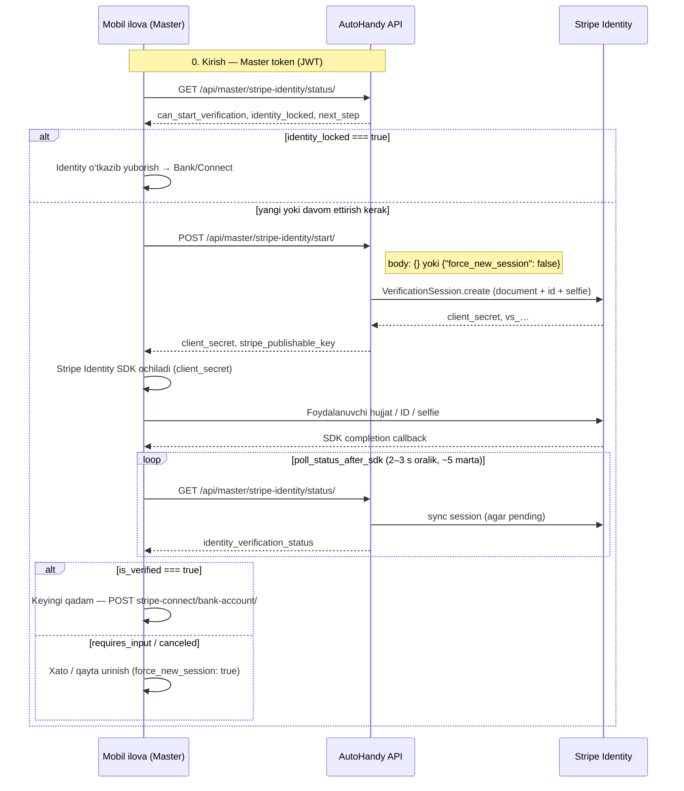

# Stripe Identity — Master (mobil integratsiya)

Master payout (Connect / bank) dan oldin shaxsini Stripe Identity orqali tasdiqlaydi: **hujjat**, **ID raqam**, **selfie** (live kamera).

Backend hech qanday hujjat rasmi yoki ID raqamini saqlamaydi — faqat holat (`verified`, `pending`, …) va Stripe session id.

---

## Qisqa javob: ha, oqim shunday

1. **Backend** — session yaratadi (`POST start`) → `client_secret` qaytadi  
2. **Mobil** — Stripe Identity **SDK** ni `client_secret` bilan ochadi  
3. **Foydalanuvchi** — SDK ichida hujjat + ID raqam + selfie ni tugatadi  
4. **Mobil** — SDK tugagach **`GET status`** chaqiradi (kerak bo‘lsa 2–3 soniyada qayta)  
5. **`is_verified` / `identity_locked`** bo‘lsa → keyingi ekran (bank / Connect)

**Webhook ixtiyoriy.** HTTPS bo‘lmasa ham ishlaydi — status faqat `GET status` orqali yangilanadi.

---

## Umumiy sxema



---

## Oqim diagrammasi (bloklar)

```
┌─────────────────────────────────────────────────────────────────┐
│                    MASTER — Stripe Identity                      │
└─────────────────────────────────────────────────────────────────┘

     ┌──────────────┐
     │  App ochiladi │
     │  (payout flow)│
     └──────┬───────┘
            │
            ▼
   ┌────────────────────┐
   │ GET .../status/    │  ← Har safar / ekranga kirganda
   └─────────┬──────────┘
             │
     ┌───────┴────────┐
     │ identity_locked │──yes──► Bank / Connect (Identity TUGAGAN)
     │  == true ?      │
     └───────┬────────┘
             │ no
             ▼
   ┌────────────────────┐
   │ POST .../start/    │  ← Session + client_secret
   └─────────┬──────────┘
             │
             ▼
   ┌────────────────────┐
   │ Stripe Identity SDK│  ← Native (iOS / Android)
   │ • Hujjat (ID)      │
   │ • ID raqam         │
   │ • Selfie (kamera)  │
   └─────────┬──────────┘
             │ SDK tugadi
             ▼
   ┌────────────────────┐
   │ GET .../status/    │  ← Poll: pending → verified
   │ (2–3 s, 3–5 marta) │
   └─────────┬──────────┘
             │
     ┌───────┴────────┐
     │ is_verified ?    │──yes──► POST bank-account / Connect
     └───────┬────────┘
             │ no (requires_input)
             ▼
        Qayta urinish (start, force_new_session: true)
```

---

## API endpointlar

| Qadam | Method | URL | Auth |
|-------|--------|-----|------|
| Holat | `GET` | `/api/master/stripe-identity/status/` | Master JWT |
| Boshlash | `POST` | `/api/master/stripe-identity/start/` | Master JWT |

**Base URL (misol):** `http://217.114.11.249:7002` yoki production domen.

**Header:** `Authorization: Bearer <access_token>`

Swagger tag: **Master Stripe Identity**

---

## 1-qadam: Status tekshirish

```http
GET /api/master/stripe-identity/status/
Authorization: Bearer <token>
```

**Muhim maydonlar (`data`):**

| Maydon | Ma’nosi |
|--------|---------|
| `identity_verification_status` | `not_started`, `pending`, `verified`, `requires_input`, `canceled`, `failed` |
| `is_verified` | `true` — tasdiqlangan |
| `identity_locked` | `true` — qayta Identity **kerak emas**, start chaqirmang |
| `can_start_verification` | `true` — POST start mumkin |
| `next_step` | `start_verification`, `continue_verification`, `proceed_to_connect`, `retry_verification`, … |
| `stripe_publishable_key` | SDK uchun `pk_test_…` / `pk_live_…` |
| `poll_status_after_sdk` | SDK dan keyin status chaqirish kerakligi |
| `webhook_optional` | `true` — webhook yo‘q, poll ishlatiladi |

**Misol — hali boshlanmagan:**

```json
{
  "status": "success",
  "data": {
    "identity_verification_status": "not_started",
    "is_verified": false,
    "identity_locked": false,
    "can_start_verification": true,
    "next_step": "start_verification",
    "stripe_publishable_key": "pk_test_...",
    "poll_status_after_sdk": true
  }
}
```

**Misol — allaqachon tasdiqlangan:**

```json
{
  "status": "success",
  "data": {
    "identity_verification_status": "verified",
    "is_verified": true,
    "identity_locked": true,
    "can_start_verification": false,
    "next_step": "proceed_to_connect",
    "identity_verified_at": "2026-05-28T12:00:00+00:00",
    "poll_status_after_sdk": false
  }
}
```

---

## 2-qadam: Session boshlash (SDK uchun)

```http
POST /api/master/stripe-identity/start/
Authorization: Bearer <token>
Content-Type: application/json

{}
```

yoki qayta urinish (faqat **verified bo‘lmagan** holatda):

```json
{
  "force_new_session": true
}
```

**Muvaffaqiyat (200):**

```json
{
  "status": "success",
  "message": "Identity verification session created.",
  "data": {
    "stripe_identity_verification_session_id": "vs_...",
    "client_secret": "vs_..._secret_...",
    "identity_verification_status": "pending",
    "stripe_publishable_key": "pk_test_...",
    "verification_checks": {
      "document": true,
      "id_number": true,
      "matching_selfie": true,
      "live_capture": true
    },
    "poll_status_after_sdk": true
  }
}
```

Mobil: `client_secret` + `stripe_publishable_key` ni Stripe Identity SDK ga bering.

**Allaqachon verified (409):**

```json
{
  "error": "Identity is already verified. Re-verification is not allowed.",
  "code": "identity_already_verified",
  "data": { "...": "GET status bilan bir xil shakl" }
}
```

---

## 3-qadam: Stripe Identity SDK (mobil)

Backend bu qadamni bajarmaydi — faqat Stripe SDK.

**Foydalanuvchi qiladi:**

1. Davlat hujjati (passport / ID card / haydovchilik guvohnomasi)  
2. ID raqamini kiritish va tekshiruv  
3. Selfie (yuzni hujjatdagi surat bilan solishtirish)  
4. Live capture — galereyadan emas, kameradan

**Stripe hujjatlari:**

- [Stripe Identity — mobile](https://stripe.com/docs/identity/verify-identity-documents?platform=mobile)
- iOS: `IdentityVerificationSheet`  
- Android: `IdentityVerificationSheet`

**Pseudocode:**

```text
// SDK init — publishable key start javobidan
StripeAPI.defaultPublishableKey = data.stripe_publishable_key

// Session ochish
present IdentityVerificationSheet(clientSecret: data.client_secret)

// completion handler
onComplete {
  pollIdentityStatus()  // GET status
}
```

---

## 4-qadam: Status (SDK tugagach)

```http
GET /api/master/stripe-identity/status/
```

Server Stripe bilan sync qiladi (`vs_…` session bo‘lsa).

**Poll qoidasi:**

- `identity_verification_status == "pending"` → 2–3 soniyada qayta chaqiring (3–5 marta)  
- `is_verified == true` → to‘xtating, bank/Connect ga o‘ting  
- `requires_input` → foydalanuvchiga xato, `POST start` + `force_new_session: true`

---

## 5-qadam: Bank / Connect

Identity **`verified`** bo‘lgach:

```http
POST /api/master/stripe-connect/bank-account/
```

Agar Identity tasdiqlanmagan bo‘lsa → **403** `identity_verification_required`.

---

## Holatlar jadvali

| `identity_verification_status` | Mobil nima qiladi |
|-------------------------------|-------------------|
| `not_started` | POST start → SDK |
| `pending` | SDK tugaguncha yoki poll status |
| `verified` | Bank/Connect; start **chaqirmang** |
| `requires_input` | SDK qayta / POST start `force_new_session: true` |
| `canceled` / `failed` | POST start (qayta) |

---

## Webhook (ixtiyoriy)

| Holat | Tavsiya |
|-------|---------|
| HTTPS + domen bor | Stripe Dashboard → webhook → `identity.verification_session.*` → `STRIPE_WEBHOOK_SECRET` |
| Faqat IP / HTTP | Webhook **shart emas** — faqat GET status poll |

URL (production): `https://<domain>/api/payment/stripe/webhook/`

---

## Server `.env`

```env
STRIPE_SECRET_KEY=sk_test_...
STRIPE_PUBLISHABLE_KEY=pk_test_...
# STRIPE_WEBHOOK_SECRET=whsec_...   # ixtiyoriy

STRIPE_IDENTITY_REQUIRE_ID_NUMBER=true
STRIPE_IDENTITY_REQUIRE_MATCHING_SELFIE=true
STRIPE_IDENTITY_REQUIRE_LIVE_CAPTURE=true
STRIPE_IDENTITY_ENFORCE_BEFORE_PAYOUT=true
```

---

## Mobil checklist

- [ ] Master token bilan `GET status`  
- [ ] Agar `identity_locked` → bank ekrani  
- [ ] `POST start` → `client_secret` olish  
- [ ] Stripe Identity SDK ochish  
- [ ] SDK tugagach `GET status` poll  
- [ ] `is_verified` → `POST stripe-connect/bank-account/`  
- [ ] Verified bo‘lgach start ni qayta chaqirmaslik (409 olasiz)

---

## Xulosa

| Savol | Javob |
|-------|--------|
| Birinchi nima? | `GET status` (yoki to‘g‘ridan-to‘g‘ri `POST start` agar ekran aniq) |
| SDK qachon? | `POST start` dan keyin `client_secret` bilan |
| Keyin nima? | `GET status` (poll), webhook shart emas |
| Kim aniqlaydi? | `request.user` → shu master profili |
| Qayta verification? | `identity_locked` bo‘lsa — **yo‘q** |
