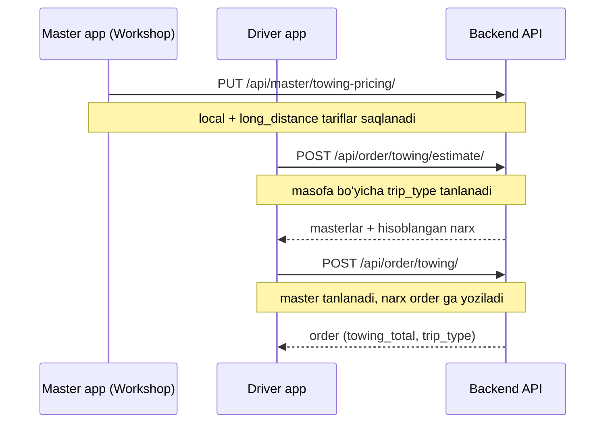

# Towing — backend hujjati

AutoHandy backendda **evakuator (towing)** buyurtmalari uchun tariflar, narx hisoblash va API oqimi.

**Oxirgi yangilanish:** 2026-06-11  
**Asosiy o‘zgarish:** bitta tarif o‘rniga **Local** va **Long Distance** tariflari qo‘shildi.

---

## Umumiy oqim



---

## Tarif turlari

| Tur | `trip_type` | Qachon ishlatiladi |
|-----|-------------|-------------------|
| **Local** | `local` | Masofa ≤ `local_max_miles` (yoki global chegara) |
| **Long distance** | `long_distance` | Masofa > chegara |

**Chegara tartibi:**

1. Master `local_max_miles` to‘ldirilgan bo‘lsa — shu ishlatiladi.
2. Aks holda — global `TOWING_LOCAL_MAX_MILES` (default **50** mil).

**Narx formulasi** (ikkala tur uchun bir xil):

```
mileage_charge = distance_miles × price_per_mile
calculated     = base_fee + mileage_charge
total_price    = max(calculated, minimum_fee)
```

Agar long-distance tarif to‘ldirilmagan bo‘lsa (0), server avtomatik **local** tarifga tushadi.

---

## Sozlamalar (`.env`)

| O‘zgaruvchi | Default | Ma’nosi |
|-------------|---------|---------|
| `TOWING_LOCAL_MAX_MILES` | `50` | Local / long-distance ajratish chegarasi (mil) |
| `TOWING_ESTIMATE_RADIUS_MILES` | `50` | Pickup atrofida qidiriladigan masterlar radiusi (mil) |

Misol:

```env
TOWING_LOCAL_MAX_MILES=50
TOWING_ESTIMATE_RADIUS_MILES=50
```

---

## Ma’lumotlar bazasi

### `MasterTowingPricing` (`apps/master/models.py`)

Har bir master uchun **bitta** yozuv (`OneToOne` → `Master`).

| Maydon | Turi | Tavsif |
|--------|------|--------|
| `local_base_fee` | Decimal | Local — bazaviy to‘lov |
| `local_price_per_mile` | Decimal | Local — mil uchun narx |
| `long_distance_base_fee` | Decimal | Long distance — bazaviy to‘lov |
| `long_distance_price_per_mile` | Decimal | Long distance — mil uchun narx |
| `local_max_miles` | Decimal, null | Master uchun local chegara (ixtiyoriy) |
| `minimum_fee` | Decimal | Minimal jami summa (ikkala tur uchun umumiy) |
| `is_active` | Boolean | `false` bo‘lsa estimate ro‘yxatida ko‘rinmaydi |
| `base_fee` | Decimal | **Legacy** — `local_base_fee` bilan sinxron |
| `price_per_mile` | Decimal | **Legacy** — `local_price_per_mile` bilan sinxron |

**Migration:** `master.0035_master_towing_local_long_distance` — eski `base_fee` / `price_per_mile` → `local_*` ga ko‘chirildi.

### `Order` towing snapshot maydonlari

Buyurtma yaratilganda narx **muzlatiladi** (keyin o‘zgarmaydi):

| Maydon | Tavsif |
|--------|--------|
| `towing_distance_miles` | Hisoblangan masofa |
| `towing_base_fee` | Tanlangan tarifning `base_fee` snapshoti |
| `towing_price_per_mile` | Tanlangan tarifning `price_per_mile` snapshoti |
| `towing_minimum_fee` | `minimum_fee` snapshoti |
| `towing_total` | Yakuniy narx |
| `towing_trip_type` | `local` yoki `long_distance` |
| `delivery_location`, `delivery_latitude`, `delivery_longitude` | Yetkazish manzili |

**Migration:** `order.0056_order_towing_trip_type`

---

## API endpointlar

Barcha URL lar `https://api.autohandy.app` ostida (local: o‘z host).

### Master — tarif sozlash (Workshop)

| Method | URL | Auth | Guruh |
|--------|-----|------|-------|
| `GET` | `/api/master/towing-pricing/` | JWT | Master |
| `PUT` | `/api/master/towing-pricing/` | JWT | Master |

**Query (ixtiyoriy):** `?master_id=123` — bir nechta workshop bo‘lsa.

#### PUT body

```json
{
  "master_id": 1,
  "local_base_fee": 80,
  "local_price_per_mile": 5,
  "long_distance_base_fee": 120,
  "long_distance_price_per_mile": 4,
  "local_max_miles": 50,
  "minimum_fee": 100,
  "is_active": true
}
```

`master_id` ixtiyoriy — bitta workshop bo‘lsa avtomatik tanlanadi.

**Legacy alias** (eski clientlar uchun): `base_fee` → `local_base_fee`, `price_per_mile` → `local_price_per_mile`.

#### GET / PUT javob (namuna)

```json
{
  "configured": true,
  "master_id": 1,
  "local_base_fee": "80.00",
  "local_price_per_mile": "5.00",
  "long_distance_base_fee": "120.00",
  "long_distance_price_per_mile": "4.00",
  "local_max_miles": "50.00",
  "minimum_fee": "100.00",
  "is_active": true,
  "local": {
    "base_fee": "80.00",
    "price_per_mile": "5.00"
  },
  "long_distance": {
    "base_fee": "120.00",
    "price_per_mile": "4.00"
  },
  "created_at": "2026-06-11T08:00:00Z",
  "updated_at": "2026-06-11T08:00:00Z"
}
```

Tarif sozlanmagan bo‘lsa: `configured: false`, barcha summalar `"0.00"`.

---

### Master — Workshop profilida towing

| Method | URL | Auth |
|--------|-----|------|
| `GET` | `/api/master/masters/` | JWT (o‘z profili) |
| `GET` | `/api/master/masters/{id}/` | JWT (faqat **egasi** ko‘radi) |

Javobda `towing_pricing` maydoni qo‘shilgan (yuqoridagi struktura bilan bir xil). Boshqa foydalanuvchilar / mijozlar uchun `towing_pricing: null`.

---

### Driver — narx taxmini

| Method | URL | Auth |
|--------|-----|------|
| `POST` | `/api/order/towing/estimate/` | JWT (Driver) |

#### Body

```json
{
  "latitude": 41.3111,
  "longitude": 69.2797,
  "delivery_latitude": 41.35,
  "delivery_longitude": 69.30,
  "distance_miles": 20,
  "radius_miles": 50
}
```

**Masofa:** `distance_miles` yuborilsa — u ustunlik qiladi. Aks holda `delivery_latitude` + `delivery_longitude` dan hisoblanadi.

#### Javob (namuna)

```json
{
  "distance_miles": "20.00",
  "trip_type": "local",
  "local_max_miles": "50.00",
  "master_count": 1,
  "masters": [
    {
      "master_id": 1,
      "master": { "...": "MasterNearbySerializer" },
      "distance_to_pickup_miles": 2.5,
      "pricing": {
        "distance_miles": "20.00",
        "trip_type": "local",
        "base_fee": "80.00",
        "price_per_mile": "5.00",
        "minimum_fee": "100.00",
        "mileage_charge": "100.00",
        "calculated_total": "180.00",
        "total_price": "180.00"
      }
    }
  ]
}
```

**Long distance misol** (60 mil, local chegara 50):

- `trip_type`: `"long_distance"`
- `base_fee`: `"120.00"`, `price_per_mile`: `"4.00"`
- `total_price`: `"360.00"` (= 120 + 60×4)

---

### Driver — towing buyurtma yaratish

| Method | URL | Auth |
|--------|-----|------|
| `POST` | `/api/order/towing/` | JWT (Driver) |

#### Body

```json
{
  "master_id": 1,
  "car_list": [42],
  "text": "Need towing",
  "location": "Pickup address",
  "latitude": 41.3111,
  "longitude": 69.2797,
  "delivery_location": "Delivery address",
  "delivery_latitude": 41.35,
  "delivery_longitude": 69.30,
  "distance_miles": 20
}
```

Server:

1. Masofani aniqlaydi
2. `trip_type` tanlaydi
3. Narxni hisoblaydi va `Order` ga yozadi
4. Master ga standart pending offer yuboradi

#### Javob — `order.towing` bloki

```json
{
  "pickup": { "location": "...", "latitude": "...", "longitude": "..." },
  "delivery": { "location": "...", "latitude": "...", "longitude": "..." },
  "distance_miles": "20.00",
  "base_fee": "80.00",
  "price_per_mile": "5.00",
  "minimum_fee": "100.00",
  "total_price": "180.00",
  "trip_type": "local"
}
```

---

## Kod tuzilmasi

| Fayl | Vazifa |
|------|--------|
| `apps/master/models.py` | `MasterTowingPricing` modeli |
| `apps/master/api/views.py` | `MasterTowingPricingView` |
| `apps/master/api/serializers.py` | `MasterTowingPricingSerializer`, `serialize_master_towing_pricing`, `MasterSerializer.towing_pricing` |
| `apps/order/services/towing_pricing.py` | Masofa, trip_type, narx hisoblash, estimate builder |
| `apps/order/api/views.py` | `TowingEstimateView`, `TowingCreateView` |
| `apps/order/api/serializers.py` | `TowingEstimateRequestSerializer`, `TowingCreateSerializer`, `OrderSerializer.get_towing` |
| `apps/order/tests_towing.py` | Unit va integration testlar |
| `config/settings.py` | `TOWING_*` sozlamalar |

---

## Frontend integratsiya (qisqa)

### Workshop (Master app)

1. **O‘qish:** `GET /api/master/masters/` yoki `GET /api/master/towing-pricing/`
2. **Saqlash:** `PUT /api/master/towing-pricing/`
3. UI: ikkita blok — **Local** va **Long Distance**, har birida `base_fee` + `price_per_mile`
4. Ixtiyoriy: `local_max_miles`, `minimum_fee`, `is_active`

### Driver app

1. Pickup + delivery kiritiladi
2. `POST /api/order/towing/estimate/` — masterlar ro‘yxati va narxlar
3. Foydalanuvchi master tanlaydi
4. `POST /api/order/towing/` — buyurtma yaratiladi

Estimate javobidagi `pricing.trip_type` va `total_price` ni UI da ko‘rsatish mumkin.

---

## Deploy checklist

```bash
git pull
python manage.py migrate
# daphne / celery restart
```

Production `.env` da kerak bo‘lsa:

```env
TOWING_LOCAL_MAX_MILES=50
TOWING_ESTIMATE_RADIUS_MILES=50
```

---

## Testlar

```bash
python manage.py test apps.order.tests_towing -v 2
```

Qamrov:

- Local narx hisoblash (20 mil → $180)
- Long distance (60 mil → $360)
- Estimate va create API
- Master tarif saqlash (legacy `base_fee` alias)
- Push notification (towing create)

---

## Eski clientlar (backward compatibility)

| Eski | Yangi |
|------|-------|
| `base_fee` | `local_base_fee` |
| `price_per_mile` | `local_price_per_mile` |
| Bitta tarif | Local + Long distance |

Eski API body (`base_fee`, `price_per_mile`) hali qabul qilinadi — local tarifga yoziladi.
