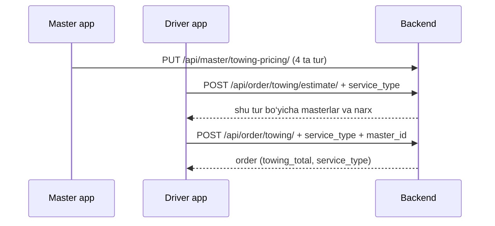

# Towing — backend hujjati

AutoHandy backendda **evakuator (towing)** — har bir xizmat turi **alohida**, haydovchi buyurtmada tur tanlaydi.

**Oxirgi yangilanish:** 2026-06-15

---

## Xizmat turlari

| `service_type` | UI nomi |
|----------------|---------|
| `local` | Local towing |
| `long_distance` | Long distance towing |
| `accident_recovery` | Accident recovery |
| `motorcycle` | Motorcycle towing |

Har bir tur uchun usta **alohida** sozlaydi:

- `base_fee` — bazaviy to‘lov  
- `price_per_mile` — mil uchun narx  
- `minimum_fee` — shu tur uchun minimal chek  
- `is_active` — faol / estimate da ko‘rinsinmi  

**Formula:**

```
total = max(base_fee + distance_miles × price_per_mile, minimum_fee)
```

Masofa **avtomatik** local/long ga o‘tkazmaydi — haydovchi `service_type` yuboradi.

---

## Umumiy oqim



---

## Sozlamalar

| O‘zgaruvchi | Default | Ma’nosi |
|-------------|---------|---------|
| `TOWING_ESTIMATE_RADIUS_MILES` | `50` | Pickup atrofida qidirish radiusi (mil) |

---

## Ma’lumotlar bazasi

### `MasterTowingPricing`

Har bir master uchun **4 tagacha** yozuv (`master` + `service_type` unique).

| Maydon | Tavsif |
|--------|--------|
| `master` | FK → Master |
| `service_type` | `local`, `long_distance`, `accident_recovery`, `motorcycle` |
| `base_fee` | Bazaviy to‘lov |
| `price_per_mile` | Mil narxi |
| `minimum_fee` | Minimal jami (shu tur uchun) |
| `is_active` | Faol tarif |

**Migration:** `master.0036_towing_service_types`

### `Order` snapshot

| Maydon | Tavsif |
|--------|--------|
| `towing_distance_miles` | Masofa |
| `towing_base_fee` | Tanlangan tur snapshot |
| `towing_price_per_mile` | Tanlangan tur snapshot |
| `towing_minimum_fee` | Tanlangan tur snapshot |
| `towing_total` | Yakuniy narx |
| `towing_trip_type` | Tanlangan `service_type` (snapshot) |

API javobida ham `service_type`, ham `trip_type` (eski clientlar uchun bir xil qiymat).

---

## API

### Workshop — tariflar

| Method | URL | Auth |
|--------|-----|------|
| `GET` | `/api/master/towing-pricing/` | Master JWT |
| `PUT` | `/api/master/towing-pricing/` | Master JWT |

Query: `?master_id=123` (bir nechta workshop bo‘lsa).

#### GET javob

```json
{
  "master_id": 1,
  "configured": true,
  "services": [
    {
      "service_type": "local",
      "label": "Local towing",
      "base_fee": "80.00",
      "price_per_mile": "5.00",
      "minimum_fee": "100.00",
      "is_active": true,
      "configured": true
    },
    {
      "service_type": "long_distance",
      "label": "Long distance towing",
      "base_fee": "120.00",
      "price_per_mile": "4.00",
      "minimum_fee": "100.00",
      "is_active": true,
      "configured": true
    },
    {
      "service_type": "accident_recovery",
      "label": "Accident recovery",
      "base_fee": "0.00",
      "price_per_mile": "0.00",
      "minimum_fee": "0.00",
      "is_active": false,
      "configured": false
    },
    {
      "service_type": "motorcycle",
      "label": "Motorcycle towing",
      "base_fee": "50.00",
      "price_per_mile": "3.00",
      "minimum_fee": "70.00",
      "is_active": true,
      "configured": true
    }
  ]
}
```

`GET` har doim **4 ta tur** qaytaradi — DB da yozuv bo‘lmasa default `0.00`.

#### PUT body (Save — bitta yoki bir nechta tur)

```json
{
  "master_id": 1,
  "services": [
    {
      "service_type": "local",
      "base_fee": 80,
      "price_per_mile": 5,
      "minimum_fee": 100,
      "is_active": true
    },
    {
      "service_type": "long_distance",
      "base_fee": 120,
      "price_per_mile": 4,
      "minimum_fee": 100,
      "is_active": true
    },
    {
      "service_type": "accident_recovery",
      "base_fee": 150,
      "price_per_mile": 6,
      "minimum_fee": 150,
      "is_active": true
    },
    {
      "service_type": "motorcycle",
      "base_fee": 50,
      "price_per_mile": 3,
      "minimum_fee": 70,
      "is_active": true
    }
  ]
}
```

Workshop profil: `GET /api/master/masters/` → `towing_pricing` (xuddi shu struktura).

---

### Driver — estimate

`POST /api/order/towing/estimate/`

```json
{
  "service_type": "local",
  "latitude": 41.3111,
  "longitude": 69.2797,
  "distance_miles": 20
}
```

Javob:

```json
{
  "service_type": "local",
  "service_label": "Local towing",
  "distance_miles": "20.00",
  "master_count": 1,
  "masters": [
    {
      "master_id": 1,
      "pricing": {
        "service_type": "local",
        "base_fee": "80.00",
        "price_per_mile": "5.00",
        "minimum_fee": "100.00",
        "total_price": "180.00"
      }
    }
  ]
}
```

---

### Driver — buyurtma

`POST /api/order/towing/`

```json
{
  "service_type": "motorcycle",
  "master_id": 1,
  "car_list": [42],
  "location": "Pickup",
  "latitude": 41.3111,
  "longitude": 69.2797,
  "distance_miles": 15
}
```

`order.towing`:

```json
{
  "service_type": "motorcycle",
  "trip_type": "motorcycle",
  "base_fee": "50.00",
  "price_per_mile": "3.00",
  "minimum_fee": "70.00",
  "total_price": "95.00"
}
```

---

## Frontend

### Workshop (screenshot dagi UI)

Har bir bo‘lim → `services[]` dagi bitta element:

| UI | `service_type` |
|----|----------------|
| Local towing | `local` |
| Long distance | `long_distance` |
| Accident recovery | `accident_recovery` |
| Motorcycle towing | `motorcycle` |

Har birida: **Base fee**, **Per mile**, **Minimum fee**, **is_active**.  
Save → `PUT` bilan barcha to‘ldirilgan turlarni yuboring.

### Driver

1. Towing turi tanlash (`local` / `long_distance` / …)  
2. Manzil + masofa  
3. `estimate` + `create` da **`service_type` majburiy**

---

## Deploy

```bash
python manage.py migrate
# restart daphne
```

Migrationlar: `master.0036_towing_service_types`, `order.0057_alter_order_towing_trip_type`

---

## Testlar

```bash
python manage.py test apps.order.tests_towing -v 2
```
